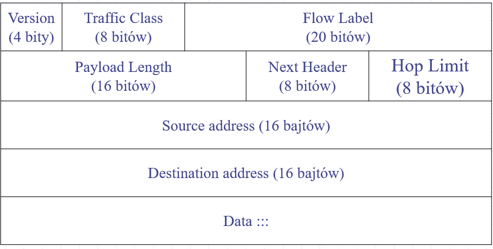
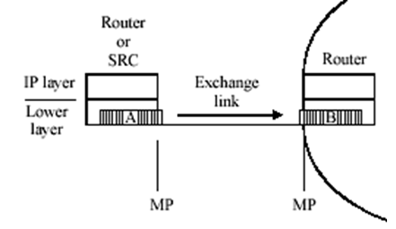
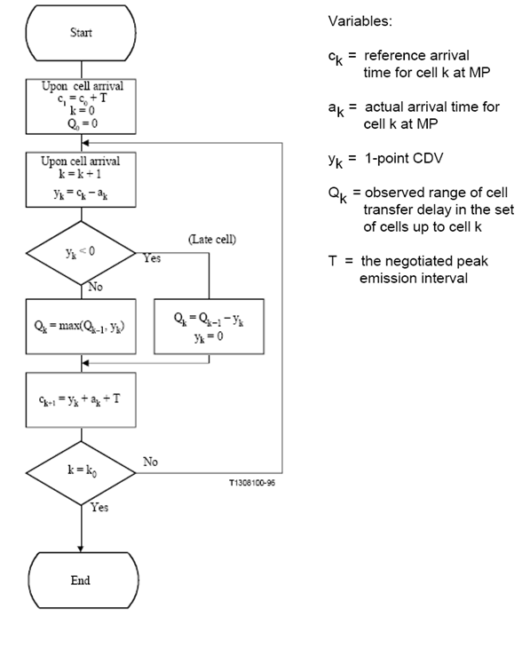

image.png# 1 Metody badania systemów

## 1.1 Symulacja i system

**Symulacja** - technika numeryczna, która pozwala na przeprowadzenie za pomocą komputera, pewnego doświadczenia badawczego. 

Symulacja służy ocenie działania badanego **systemu**, dlatego podczas symulacji gromadzone są dane w celu oszacowania charakterystyk opisujących badany **system**

**System** - pewien zbiór elementów oraz ich powiązań, które działają lub współdziałają wzajemnie, aby osiągnąć pewne logiczne zakończenie działania

> Np. systemem jej sieć telekomunikacyjna. Elementy to urządzenia sieciowe, powiązania elementów to protokoły sygnalizacyjne itp. logiczne zakończeniem działania jest np. zestawienie połączenia dla usera.

W celu przeprowadzenia badania symulacyjnego opisujemy *system* najczęściej za pomocą matematycznych lub logicznych powiązań.

> No bo jest tak, że wprowadzamy na pierwszej stronie jakiś aksjomat, a potem na podstawie powiązań definiujemy resztę elementów.

Opis ten stanowi **model**, który jest używany do próby zrozumienia działania badanego systemu.

## 1.2 Modelowanie analityczne

**Model systemu** opisany jest za pomocą równań, które opisują jego **stan** oraz zmiany *stanu*

Problem wtedy rozwiązywany jest w sposób analityczny (czyli analizujemy te równania). Najczęściej "w stanie ustalonym", czyli w jakiejś chwili gdzie nic się nie zmienia.

> Często wykorzystywanym aparatem matematycznym w telekomie jest **teoria kolejek**.

Jednakże niektóre złożone systemu bardzo trudno opisać, a dodatkowym problemem jest to, że tylko niektóre modele mają znane rozwiązania (matematyczne).

## 1.3 Emulacja

**Emulacja** - technika, w której urządzenie/oprogramowanie "udaje" rzeczywiste urządzenie sieciowe lub nawet fragment sieci

Inne elementy (rzeczywiste elementy) nie są świadome, że wykorzystywana jest technika emulacji.

> Przykłady:
>
> - emulacja sieci z wykorzystywaniem techniki wirtualizacji
> - emulacja sieci z punktu widzenia charakterystyk przekazu pakietów (opóźnienie, straty,..)
>   - Netem (linoksowa komenda, która można emulować "coś" w sieci, czyli np. ze interfejs ma packet loss na 0.1% ustawiony)
>   - Atero (nic nie ma w necie)

## 1.4 Pomiar

**Pomiar** - proces odziaływania **przyrządu pomiarowego** z **badanym obiektem**, zachodzący w czasie i przestrzeni, którego wynikiem jest uzyskanie informacji o własnościach obiektu.

- pomiar pozwala uzyskać informacje o przeszłości
- pomiar jedynie estymuje wartość rzeczywistą
- pomiar jest obarczony błędem

**rozdzielczość** - najmniejsza zmiana wielkości mierzonej na jaką reaguje *przyrząd pomiarowy*

### Metoda pomiarowa

**Metoda pomiarowa** - określa sposób pomiaru danej metryki. Metoda powinna zapewnić, że pomiar jest powtarzalny.

Metody pomiarowe dzielimy na dwie grupy:

- aktywna
- pasywna

#### Aktywna

Na odbiorniku jest jakiś system pomiarowy i on wysyła gotowe wyniki pomiarów (szybkość na łączu, straty pakietów itp.) do serwera zarządzającego.

Więc system aktywnie dokonuje pomiaru.

#### Pasywna

Nadajnik i odbiornik żyją swoim życiem i tylko raportują stan do serwera zarządzającego. Serwer już sam na podstawie raportów dokonuje pomiaru (szybkość na łączu, straty pakietów).

Więc system nie dokonuje pomiaru, a robi to serwer.

## 1.5 Sieci badawcze

W Polsce są sieci badawcze xd

## 1.6 Sieci IP

### Cechy

- Sieć oparta o komutację pakietów
  - Zmienna długość pakietów

- Bezpołączeniowy tryb transmisji
  - Każdy pakiet zawiera pełną informację adresową
  - Każdy pakiet może być przesyłany inną drogą (brak gwarancji na integralność przesyłanego strumienia danych)
- Tradycyjnie była wspierana tylko jedna usługa sieciowa - **best effort** (wszystkie pakiety traktowane identycznie)
  - Obecnie opracowano mechanizmy różnicowania pakietów i zapewnienie jakości obsługi (Quality of Service) -> co doprowadziło do wprowadzenia usług sieciowych
- Brak mechanizmów anty-przeciążeniowych i mechanizów sterowania ruchem
  - Sterowania po stronie użytkownika, userem sieci IP moze być protokół TCP i to on właśnie robi mechanizmy sterowania ruchem)
- Powszechnie używana
  - Internet
  - Sieci operatorów
  - Sieci wojskowe

### Działanie

### Autonomous Systems

Sieć IP zbudowana jest z niezależnych AS'ów (domen)

An **Autonomous System** (AS) is a set of Internet routable IP prefixes belonging to a network or a collection of networks that are all managed, controlled and supervised by a single entity or organization.

The AS is assigned a globally unique 16 digit identification number一known as the autonomous system number or ASN一by the Internet Assigned Numbers Authority (IANA).

Autonomous systems numbered one to 64511 are available by IANA for global use. The 64512 to 65535 series is reserved for private and reserved purposes. Autonomous Systems were introduced to regulate networking organizations such as Internet Service Providers (ISP), educational institutions and government agencies.

Border Gateway Protocol (BGP) is the protocol that manages the routed peerings, prefix advertisement and routing of packets between different autonomous systems across the Internet. BGP uses the ASN to uniquely identify each system. In effect, BGP is the routing protocol for AS paths across the Internet.

### Fomart pakiet IPv4

**Version** - 4

**Internet Header Lenght** -  The IPv4 header is variable in size due to the optional 14th field (options). The IHL field contains the size of the IPv4 header; it has 4 bits that specify the number of 32-bit words in the header. The minimum value for this field is 5,[[37\]](https://en.wikipedia.org/wiki/IPv4#cite_note-37) which indicates a length of 5 × 32 bits = 160 bits = 20 bytes. As a 4-bit field, the maximum value is 15; this means that the maximum size of the IPv4 header is 15 × 32 bits = 480 bits = 60 bytes.

**Type of service** - this field specifies differentiated services (DiffServ) per RFC 2474.

**Total Length**  - This 16-bit field defines the entire packet size in bytes, including header and data. The minimum size is 20 bytes (header without data) and the maximum is 65,535 bytes. 

**Identification** - This field is an identification field and is primarily used for uniquely identifying the group of fragments of a single IP datagram. Some experimental work has suggested using the ID field for other purposes, such as for adding packet-tracing information to help trace datagrams with spoofed source addresses, but RFC 6864 now prohibits any such use.

**Flags** - A three-bit field follows and is used to control or identify fragments. They are (in order, from most significant to least significant):

- bit 0: Reserved; must be zero.[[b\]](https://en.wikipedia.org/wiki/IPv4#cite_note-40)
- bit 1: Don't Fragment (DF)
- bit 2: More Fragments (MF)

**Fragment offset** - This field specifies the offset of a particular fragment relative to the beginning of the original unfragmented IP datagram in units of eight-byte blocks. The first fragment has an offset of zero. The 13 bit field allows a maximum offset of (213 – 1) × 8 = 65,528 bytes, which, with the header length included (65,528 + 20 = 65,548 bytes), supports fragmentation of packets exceeding the maximum IP length of 65,535 bytes.

**Time to live**  - An eight-bit [time to live](https://en.wikipedia.org/wiki/Time_to_live) field limits a datagram's lifetime to prevent network failure in the event of a [routing loop](https://en.wikipedia.org/wiki/Routing_loop). 

**Protocol ** - this field defines the protocol used in the data portion of the IP datagram. IANA maintains a [list of IP protocol numbers](https://en.wikipedia.org/wiki/List_of_IP_protocol_numbers) as directed by RFC 790.

**Header checksum** - The 16-bit [IPv4 header checksum](https://en.wikipedia.org/wiki/IPv4_header_checksum) field is used for error-checking of the header. When a packet arrives at a router, the router calculates the checksum of the header and compares it to the checksum field. If the values do not match, the router discards the packet. Errors in the data field must be handled by the encapsulated protocol. Both [UDP](https://en.wikipedia.org/wiki/User_Datagram_Protocol) and [TCP](https://en.wikipedia.org/wiki/Transmission_Control_Protocol) have separate checksums that apply to their data.

When a packet arrives at a router, the router decreases the TTL field in the header. Consequently, the router must calculate a new header checksum.

**Source address** - This field is the [IPv4 address](https://en.wikipedia.org/wiki/IPv4_address) of the sender of the packet. Note that this address may be changed in transit by a [network address translation](https://en.wikipedia.org/wiki/Network_address_translation) device.

**Destination address** - this field is the [IPv4 address](https://en.wikipedia.org/wiki/IPv4_address) of the receiver of the packet. As with the source address, this may be changed in transit by a network address translation device.

**Options** - The options field is not often used. Packets containing [some options may be considered as dangerous](https://en.wikipedia.org/wiki/Internet_Protocol_Options_Considerations) by some routers and be blocked

### Format pakietu IPv6

An IPv6 packet has three parts: an IPv6 basic header, one or more IPv6 extension headers, and an upper-layer protocol data unit (PDU)

An upper-layer PDU is composed of the upper-layer protocol header and its payload, which maybe an ICMPv6 packet, a TCP packet, or a UDP packet.

**Version** - 6

**Traffic Class** - 8 bits long. This field indicates the class or priority of an IPv6 packet. Used in QoS control.

**Flow Label** - 20 bits long. This field was added in IPv6 to differentiate traffic. A flow label and source IP address identify a data flow. Intermediate network devices can effectively differentiate data flows based on this field.

**Payload Length** - 16 bits long. This field indicates the length of the IPv6 payload in bytes. The payload is the part of the IPv6 packet following the IPv6 basic header, including the extension header and upper-layer PDU. This field has a maximum value of 65535. If the payload length exceeds 65535 bytes, the field is set to 0, and the Jumbo Payload option in the Hop-by-Hop Options header is used to express the actual payload length

**Next Header** -  bits long. This field identifies the type of the first extension header that follows the IPv6 basic header or the protocol type in the upper-layer PDU.

**Hop Limit** -  This field is similar to the Time to Live field in an IPv4 packet, defining the maximum number of hops that an IP packet can pass through. Each device that forwards the packet decrements the field value by 1. If the field value is reduced to 0, the packet is discarded.

**Source Address** -  128 bits long. This field indicates the address of the packet originator.

**Destination Address** -  128 bits long. This field indicates the address of the packet recipient.

### QoS - Typy ruchu

CBR - Constant Bit Rate

VBR - Varying Bit Rate

### Jakość obsługi

Poziom sieci - opóźnienie pakietów (**delay**), zmienność opóźnienia (**jitter**), poziom strat (**packet loss**), przepływność (**bit rate**)

Poziom usera - **Mean Opinion Score** (MOS)

### Podsumowanie

## 1.7 Rola systemów pomiarowych

Pomiar, oprócz metod analitycznych i symulacyjnych JEST PODSTAWOWYM ŹRÓDŁEM WIEDZY O STANIE SIECI, bo:

- Sieć IP jest bardzo złożoną strukturą i podlega ciągłym zmianom
- Obiążenie ruchem w sieci IP jest trudne do prognozowania
- Dostępne i stosowane dotychczas modele analityczne w wielu przypadkach nie są w stanie dostarczyć wystarczającej wiedzy o stanie sieci
- zastosowanie metod sterowania ruchem opartych na pomiarach pozwala zwiększyć ich efektywność (jesteśmy responsywni)

# 2 Metryki pomiarowe

## 2.1 Metryka pomiarowa

**Metryka pomiarowa** - to jasno wyspecyfikowana ilość czegoś związanego z performancem lub niezawodnością badanego systemu

**Metryka pomiarowa** - definiuje co będzie mierzone. Jest to zbiór parametrów lub sposób na przypisywanie ilości czemuś (quantitative assessment) co będzie mierzone, razem z opisaniem procesu dokonywania mierzenia

**Metryka pomiarowa** -  kryterium używane do oceny jakości systemu

**Metryka pomiarowa** - z ang. "metrics"

### Właściwości

- The metrics must be concrete and well-defined

- A methodology for a metric should have the property that it is repeatable: if the methodology is used multiple times under identical conditions, the measurements should result in the same values. 

- The metrics must exhibit no bias for IP clouds implemented with identical technology

- The metrics must exhibit understood and fair bias (stronniczość, uprzedzenie) for IP clouds implemented with non-identical technology

- The metrics must be useful to users and providers in understanding the performance they experience or provide

- The metrics must avoid inducing artificial performance goals

### Standaryzacja

Narzędzia pomiarowe mierzą zestandaryzowane metryki (zgodnie z definicjami i właściowościami)

Zwiększa to wiarygodność raportowanych wyników i możliwość porównywania wyników pomiarów dokonanych za pomocą różnych narzędzi.

> Prace standaryzacyjne prowadzone w ramach organizacji ITU-T i IETF
>
> Mimo pewnych różnic w definicjach metryk ogólne zasady są podobne

## 2.2 Rodzaje metryk

Metryk związane z poziomem:

- pakietów
- połączeń
- użytkownika

## 2.3 Metryk związane z poziomem pakietów

### Metryki ITU-T (Y.1540)

#### Zalecenie ITU-T Y.1540

Internet protocol data communication service – IP packet transfer and availability performance parameters

Defniuje ono metryki dla:

- pojedynczych pakietów pomiarowych  - **singleton**
- pewnej liczby pakietów pomiarowych - **parametry statystyczne próby**

#### IPTD - IP Packet Transfer Delay

**Dla danego pakietu** jest to czas upływający pomiędzy chwilą wysłania pierwszego bitu a momentem odebrania ostatniego bitu danego pakietu w mierzonej sieci lub jej części

**Parametry statystyczne** próby

nminimalne opóźnienie (min IPTD)

nmaksymalne opóźnienie (max IPTD) 

nśrednie opóźnienie (mean IPTD)

MP - Measurmenet Point

#### IPDV - IP Packet Delay Variation

**Dla danego pakietu** jest zdefiniowane jako różnica IPTD tego pakietu i pewnego pakietu, którego IPTD jest traktowane jako punkt odniesienia. Może być zdefiniowane w odniesieniu do IPTD pierwszego pakietu w strumieniu, najmniejszego IPTD w próbie lub średniego IPTD w próbie

**Dla danego zbioru pakietów** to różnica pomiędzy kwantylem rzędu (1-a) rozkładu opóźnienia przekazu pakietów IPTD a wartością minimalnego opóźnienia minIPTD w danym przedziale czasu, np. a=10-3

#### IPLR - IP Packet Loss Rate

**Dla danego zbioru pakietów** to stosunek liczby pakietów straconych do liczby pakietów wysłanych w danym okresie pomiarowym

Za stracone uznaje się pakiety pomiarowe które nie dotarły do odbiornika przed upływem czasu Tmax (zalecane 3s).

#### IPER - IP Packet Error Ratio

**Dla danego zbioru pakietów** to stosunek liczby pakietów z błędami w polu danych pakietu (przy czym z poprawnym nagłówkiem) do liczby pakietów wysłanych w danym okresie pomiarowym

#### IPPR - IP Packet Rate

 **Dla danego zbioru pakietów** - to stosunek liczby pakietów odebranych w danym okresie pomiarowym do długości tego okresu pomiarowego

#### IPOR - Octed-based IP Packet Rate

**Dla danego zbioru pakietów** - stosunek liczby bajtów zawartych w pakietach odebranych w danym punkcie sieci w pewnym okresie pomiarowym do długości tego okresu

> Przepływność dostępna dla aplikacji jest zawsze mniejsza np. ze względu na, m.in. wpływ nagłówków, mechanizmów warstwy transportowej 

#### Dostępność usługi - IP Service Availability

Usługa jest uważana za dostępną jeśli w danym okresie pomiarowym o długości Tav wartość IPLR (IP packet loss rate) jest mniejsza od założonego progu c1. ==> IPLR < C1

Zalecana długość przedziału pomiarowego to co najmniej Tav=5 minut, badana próba powinna zawierać co najmniej Mav=1000 pakietów

Wartość progu c1 jest uzależniona od rodzaju klasy usługi

- dla klasy standard c1=0.75

- dla klasy 0 c1 = 0.03

- dla klasy 1 c1 = 0.2 

Okresy czasu kiedy usługa jest niedostępna nie powinny być brane pod uwagę przy wyznaczaniu poziomu strat pakietów jako parametru jakości danej klasy usługi

### Metryki IETF - IP Performance Metrics

Grupa zaleceń RFC opracowanych przez grupę roboczą IPPM (IP Performance Metrics)

Defniuje ono metryki dla:

- pojedynczych pakietów pomiarowych  - **singleton**
- pewnej liczby pakietów pomiarowych - **parametry statystyczne próby**

#### Connectivity metric - Dostępnośc

Możliwość przekazu pakietów pomiędzy danym źródłem a urządzeniem docelowym

Urządzenie docelowe jest uznawane za dostępne jeśli pakiet wysłany ze źródła dotrze do urządzenia docelowego w określonym czasie W (zalecane 10s)

#### One Way Delay metric

Czas przekazu pakietu pomiędzy dwoma punktami w sieci.

OWD **danego pakietu** ma wartość ΔT, jeśli źródło wysłało pierwszy bit danego pakietu w chwili T, a urządzenie docelowe odebrało ostatni bit tego pakietu w chwili T+ΔT 

> Główne źródła błędów pomiaru
>
> - Niepewność synchronizacji zegarów nadajnika i odbiornika
>
> - Wpływ czasu przetwarzania pakietu w nadajniku i odbiorniku („host time” vs. „wire time”)

Wartość tej metryki **dla danego zbioru pakietów** (próbki) podaje się w postaci parametrów statystycznych tj.: 

- Minimalne opóźnienie OWD (One-way-Delay-Minimum), zdefiniowane jako najmniejsza wartość opóźnienia w danej próbie

- Średnie opóźnienie OWD, zdefiniowane jako średnia wartość z próby

- Percentyl opóźnienia OWD (One-way-Delay-Percentile) określony jako x-ty percentyl opóźnienia danej próby

- Mediana opóźnienia OWD (One-way-Delay-Median) zdefiniowane jako wartość mediany danej próby

#### IP Packet Delay Variation metric (IETF)

Różnica pomiędzy wartością OWD dla dwóch pakietów w mierzonym strumieniu

**Dla danego pakietu** zwykle podaje się IPDV jako różnicę OWD tego pakietu i poprzedniego pakietu w ramach danego strumienia

**Dla danego zbioru pakietów** definiuje się parametry statystyczne

- Średnie IPDV jako średnia wartość IPDV wszystkich pakietów w próbie

- Percentyl IPDV jako x-ty percentyl IPDV w danej próbie 

#### Round-Trip Delay metric 

Opóźnienie przekazu pakietu mierzone na drodze pomiędzy źródłem-przeznaczeniem-źródłem (w pętli)

Metryka ma wartość ΔT, jeśli źródło wysłało pierwszy bit danego pakietu w chwili T, urządzenie docelowe po odebraniu pakietu natychmiast odesłało pakiet do źródła a źródło odebrało ostatni bit tego pakietu w chwili T+ΔT

#### One Was Packet Loss metric

**Dla danego pakietu** metryka ta przyjmuje wartość 0 w przypadku poprawnego odebrania pakietu lub wartość 1 w przeciwnym przypadku 

Za stracone uznaje się pakiety pomiarowe które nie dotarły do odbiornika przed upływem czasu Tmax

Wartości oczekiwana metryki OWL wyznaczona **dla danej próbki pakietów** oznacza poziom strat pakietów 

> Główne źródła błędów pomiaru
>
> - Zbyt mała wartość Tmax
>
> - Straty pakietów w nadajniku lub odbiorniku, spowodowane np. niewystarczającą wydajnością urządzeń pomiarowych

#### One Way Loss Pattern sample metrics

Straty pakietów w ramach danego strumienia mogą występować pojedynczo lub w paczkach (**loss burst**)

Zestaw metryk określających sposób występowania strat pakietów w ramach strumienia

- Odstęp pomiędzy straconymi pakietami („loss distance”)

- Okres strat („loss period”)

#### Packet Reordering metric

Uznaje się, że pakiet dotarł do odbiornika w niewłaściwej kolejności w ramach danego strumienia jeśli jego numer sekwencyjny jest *mniejszy* od numeru sekwencyjnego oczekiwanego przez odbiornik

>  Przykład 
>
> Sekwencja pakietów w odbiorniku: 1, 2, 3, 5, 4, 6 ==> Uznaje się, że pakiet nr. 4 dotarł w niewłaściwej kolejności

Metryka **Reorded Packet Ratio** jest zdefiniowana jako stosunek liczby pakietów które dotarły do odbiornika w niewłaściwej kolejności, do wszystkich odebranych pakietów 

#### Framework for defining Bulk Transfer Capacity metric

Intuicyjnie, BTC jest określone jako długoterminowa średnia szybkość bitowa jaką może uzyskać pojedyncze połączenie TCP pomiędzy dwoma punktami sieci.

Różne implementacje TCP: Taho, Reno, New Reno, Sack, Vega, Qube...   ===>

Poprawna i jednoznaczna definicja metryki jest trudna, właściwie niemożliwa

### Metryki związane z ruchem

#### Obiążenie łącza (Link Load)

Metric is defined in terms of the statistical parameters, like the mean bit rate, maximum bit rate, or variance of the bit rate. 

Note, that the statistics can be defined over different time scales, i.e. from a sample collected within different time periods. 

Statistical metrics are obtained by the processing of the data obtained by passive monitoring.

#### Macierz ruchu (Traffic matrics)

#### Dostępna przepływność (Available bandwidth)

Definiuje dostępną przepływność łącza lub ścieżki

## 2.4 Metryki związane z poziomem połączeń

### Call blocking probability

metryka definiuje stosunek liczby niezrealizowanych połączeń do liczby prób zestawienia połączenia 

### Call set-up latency

Czas pomiędzy pierwszą wiadomoscią "set-up message" od user do sieci, a ostatnią wiadomością sygnalizacyjną od sieci do usera, że dotarto do drugiego usera i on musi potwierdzić.

The call set-up latency Tset-up is defined as the time between submission of the first bit of *set-up* message send to network from the user terminal initialising a call and the receiving the last bit of the *alerting* message received from the network. It should be reported as mean < 400ms and quantile 95% <600ms

### Call release latency

defined as the time interval from submission the first bit of the release message to the network by the user terminal which terminates the call until the last bit of the release_ack message is received by the same terminal.

### Busy Hour Call Attempt

A maximum number of call attempts the exchange can handle

## 2.5 Metryki związane z poziomem użytkownika

### Mean Opinion Score (MOS)

The mean of opinion scores  i.e., of the values on predefined scale that subjects assign to their opinion of the performance of the telephone transmission system used either for conversation or for listening to spoken material

Wartości MOS: 

5 – excellent, 

4 – good, 

3 – fair, 

2- poor, 

1- bad

### Metody pomiaru MOS

**Subiektywne** – oparte na ocenie jakości przez użytkowników

**Obiektywne** – wyznaczające wartość MOS przez porównanie próbek mowy nadanej z odebranymi - ITU P.862 PESQ (Perceptual evaluation of speech quality)

**Estymowane** – obliczają wartość MOS na podstawie metryk opóźnienia, zmienności opóźnienia, poziomu strat, kodeka itd. np. za pomocą E-modelu (ITU G.107)

### Metoda subiektywna MOS-LQS

**Logatom** - to charakterystyczne dla danego języka złożenie fonemów nie posiadające znaczenia

#### Metoda pomiaru

- Lektor odczytuje list logatomowe (po 100 logatomów)

- Słuchacze zapisują usłyszane logatomy

### Metoda obiektywna MOS-LQO

P.862 PESQ (Perceptual evaluation of speech quality)

### Metoda estymowana MOS-LQE

E-Model (G.107) zakłada, że wartość metryki MOS jest obliczana na podstawie wartości R wyznaczone z parametrów systemu

*Ro* – stosunek sygnał-szum

Is - czynniki zniekształcajace transmisje głosu

Id - czynniki wynikające z opóźnienia 

Ie_eff - czynniki związane ze stratami

A – współczynnik korygujący związany z użytecznością sygnału

IPTD - IP Packet Transfer Delay

IPDV - IP Packet Delay Variation

IPLR - IP Packet Loss Rate

No i wtedy wartość MOS wyznaczamy jako funkcję parametru R

# 3 Metody pomiarowe

**Metoda pomiarowa** - określa sposób pomiaru danej *metryki pomiarowej*

Metoda powinna zapewnić, że pomiar jest powtarzalny.

W metodzie zależy nam na:

- Jak najmniejszej ingerencji w mierzony system
  - np. dodatkowy ruch używany do pomiaru powinień być małym ułamkiem całości ruchu w systemie
- Jak najmniejsza złożoność implementacyjna
  - chodzi o to, żeby koszt był niski

## 3.1 Rodzaje metod

Dzielimy je dwa razy (ze względu na dwie rzeczy)

- aktywne i pasywne
- jedno i dwupunktowe

**Metody aktywne** – mierzą wartości metryk na podstawie dodatkowo wygenerowanego ruchu pomiarowego (**probe packets**)

**Metody pasywne** – mierzą wartości metryk na podstawie ruchu generowanego przez użytkowników

**Metody jednopunktowe** – pomiar jest realizowany w jednym punkcie

**Metody dwupunktowe** – wymagają zastosowania dwóch (lub więcej) punktów pomiarowych

### Metody aktywne

Mierzą wartości metryk na podstawie dodatkowo generowanych pakietów pomiarowych

**Czy zmierzone wartości dotyczą pakietów użytkownika?** 

Nie, ale błąd będzie mały jeśli pakiety pomiarowe są podobnego rozmiaru, przesyłane tą samą drogą i obsługiwane w ten sam sposób co pakiety użytkowników to zmierzone wartości stanowią estymację wartości rzeczywistych

**Czy konieczna jest synchronizacja czasu pomiędzy punktami pomiarowymi?**

Tak, dla pomiaru opóżnienia przekazu

#### Narzędzia pomiarowe

Przykładowe narzędzie pomiarowe to MGEN

#### **Podsumowanie**

- Dodatkowy ruch pomiarowy
- Wynik jest tylko oszacowaniem wartości metryk dla użytkowników
- Stosunkowo łatwa implementacja

### Metody pasywne

**Mierzą wartości metryk** na podstawie „obserwacji” ruchu generowanego przez użytkowników

Obserwacja i rejestracja „śladów pakietu” (tzw. packet trace) w co najmniej dwóch punktach pomiarowych

Zapis „śladów” z punktów pomiarowych jest przesyłany do serwera zarządzającego pomiarami 

Obliczenie wartości metryk jest realizowane na podstawie znaczników czasowych nadanych danemu pakietowi w dwóch różnych punktach pomiarowych

**Czy zmierzone wartości są reprezentatywne?**

Tak, bo to ruch kliencki

**Czy konieczna jest synchronizacja czasu?**

Nie

**Packet ID**

Generowanie „Packet ID” – funkcja skrótu uruchomiona na polach nagłówka/danych które nie ulegają zmianie w trakcie przekazu pakietu przez sieć

Jednoznaczny „Packet ID” pozwala wykryć pakiety zaobserwowane w dwóch punktach pomiarowych

#### Narzędzia pomiarowe

Narzędzia programowe (libpcap)

- tcpdump
- tshark
- wireshark

Narzędzia sprzętowe

- Karta DAG
- Spirent
- IXIA

#### Podsumowanie

- Pomiar opóźnienia jakiego rzeczywiście doznają pakiety użytkowników

- Dodatkowy ruch związany z przesyłaniem „trace-ów” do serwera zarządzającego 
- Pasywne monitorowanie i rejestracja wszystkich pakietów jest trudna na bardzo szybkich łączach

### Metody dwupunktowe

wymagają zastosowania dwóch (lub więcej) punktów pomiarowych

**problemy**

Synchronizacja zegatów punktów pomiarowych

### Metody jednopunktowe

pomiar jest realizowany w jednym punkcie:

- Round Trip Delay
- IP Packet Delay Variation (wersja 1-point)

#### 1-point IP Packet Delay Variation

Zakłada, że pakiety pomiarowe są wysyłane w stałych odstępach czasowych T.

Nie wymaga synchroznizacji zegarów odbironika i nadajnika.

>  Stosowana do pomiaru parametru jitter w protokole RTP

Pozwala estymować wartość IPDV

## 3.2 Rodzaje pomiarów

Dzielimy dwa razy:

- on-line i off-line
- in-service i out-of-service

### Pomiar off-line

Wyniki zbierane i przetwarzane dopiero po całkowitym zakończeniu procesu pomiarowego 

> Zastosowanie
>
> - testowanie urządzeń i mechanizmów sieciowych

### Pomiar on-line

Wyniki zbierane z punktów pomiarowych w określonych odstępach czasowych, bez przerywania procesu pomiarowego

Mechanizm przesuwającego się okna pomiarowego

> Zastosowanie:
>
> - Pomiar "na bieżąco" w działającej sieci (mechnizm okna w TCP)
> - Informacje dla operatora sieci

### Pomiar in-service

Zakłada, że pakiety pomiarowe są wprowadzone w ramach strumienia generowanego przez użytkownika (jako dodatkowe pakiety testowe). Czyli sieć wysyła dodatkowe pakiety (zwane testowymi) w istniejącym połączeniu usera.

#### Pomiar out-of-service

Zakłada, że pakiety pomiarowe biorą się z zestawienia dodatkowego połączenia w sieci, które ofc. nie przenosi danych użytkownika.

## 3.3 Metody pomiarów dostępnego pasma/przepływności

### Pasywne

**Analiza statystyk routerów**

- Wymagany dostęp do węzłów na ścieżce

- Problem z dokładnością ze względu na „nieokreślony” czas odpowiedzi routera

**Przechwytywanie pakietów**

- Wymagany dostęp do łączy

- Problem z dużymi przepływnościami łączy

### Aktywne

#### Dyspersja par pakietów

Ze źródła w jakimś odstępie czasowym Δin wysyłane są dwa pakiety o tym samym adresie docelowym, ale ruter do którego trafią z powodu obsługiwania pozostałego ruchu wciśnie między nie jakieś inne pakiety (Rcross). 

##### Pociąg pakietów

Metodę dyspersji par pakietów można rozbudować o pociagi pakietów.

##### Narzędzia pomiarowe

Pary pakietów:

- Pathrate, bprobe

Pociągi pakietów

- cprobe

#### Metoda chwilego przeciążania

Jeżeli chwilowo szybkość strumienia pomiarowego R jest większa od wielkości dostępnego pasma AvB to wartość opóźnienia pakietów wzrasta

SND - sender, RCV - receiver, R(n) - Rate, AvB (Available Bandwidth)

##### Narzędzia pomiarowe

- Pathload
- IGI
- Pathchrip

# 4 Analiza wyników pomiarowych

## 4.1 Wynik pomiaru jako zmienna losowa

! Trzeba pamiętać, że każdy pomiar jest obarczony błędem !

Zmierzone wartości metryk np. opóźnienie, jitter, staty są **próbą** pewnej **zmiennej losowej**

Powtórzenie pomiaru w takich samych warunkach zwykle daje inną *próbę*

Wyniki serii pomiarów stanowią **próbę losową**

- pakiety pomiarrowe w ramach okna pomiarowego
- wyniki kolejnych powtórzeń eksperymentu

**Zmienna losowa** - funkcja o wartościach rzeczywistych określona na zbiorze zdarzeń elementarnych

> np. jak mierzymy opóźnienie, to one przyjmować jakieś zdarzenie elementarne
>
> czyli zdarzyło się, że opóźnienie wynosi 2ms
>
> W przypadku opóźnienia są to liczby rzeczywiste
>
> Ale jak zmienną losową jest strata pakietów, określona z dokładnością do 1%, to wielkość zbioru zdarzeń elementarnych wynosi 101

**Dystrybuanta** dla danej wartości `a` określa, prawdopodobieństwo, że zmienna losowa będzie mniejsza od `a`.

**Funkcja gęstości prawdopodobieństwa** (pochodna z dystrybuanty) to taka funkcja, że całka z niej obliczona w pewnych granicach jest równa wartości p-stwa wystąpienia danego zdarzenia losowego (określonego tymi granicami).

**Wartość oczekiwana** zmiennej losowej określa, na jaką wartość tej zmiennej jest najwięskze p-stwo.

**Wariancja** zmiennej losowej określa jak bardzo zazwyczaj wartość zmiennej losowej rózni się od wartości oczekiwanej.

## 4.2 Estymacja parametrów zmiennej losowej

**Próba losowa** - zbiór wyników pomiarów

Na podstawie wartości elementów próby (kolejnych wyników powtarzanego pomiaru) chcemy estymować parametry rozkładu populacji. 

>  Żeby zauważyć jakąś ogólną tendencję i już wiedzieć, że to się zawsze tak daje opisywać. I właśnie szukamy tego TAK, żeby nie musieć mierzyć tego samego non-stop

Statystyki:

- wartość średnia z próby
- wariancja próby

### Wartość średnia z próby

## 4.3 Mediana

**Mediana** - to taka wartość zmiennej losowej, że wartość mniejsze bądź większe od mediany są tak samo prawdopodobne.

Jak mamy posortowany rosnącą ciąg wartości (posortowaną próbę), to mediane liczymy ze wzoru:

Mediana jest bardziej odporna na występowania wartości odstających od wartości średniej z próby

Czasem bardziej użyteczna gdy chcemy podać „najbardziej typową” wartość w próbie

## 4.4 Moda

Moda to te wartości, które są najbardziej prawdopodobne. Czyli po prostu maksimum funkcji gęstości p-stwa

Moda może nie istniej (np. rozkład jest jednostajny, rzut kostką nie ma mody) lub może ich być więcej niż jedna (rzut kostką, która ma ściany 1,1,3,4,4,6).

## 4.5 Wskaźnik rozproszenia

Estymator nieobiążony wariancji

Odchylenie standardowe

## 4.6 Współczynnik zmienności (wariancji)

## 4.7 Kwantyl, Percentyl

### **Przykład**

### **Praktyczne zastosowanie**

## 4.8 Przedziały ufności

^Tu powinien być drugi rysunek ale coś go nie ma.

### Dla wartości średniej

#### Przykład

## 4.9 Prezentacja wyników pomiarowych

### Histogram

Dzielimy zakres zaobserwowanych wartości zmiennej losowej na przedziały o równej szerokości

Wyznaczamy częśtość występowania wartości w poszczególnych przedziałach

### Wykres - skala liniowa

### Wykres - dwie skale

### Wykres - skala logarytmiczna

### Wykres porównanie wyników

### Wykres - porównanie wyników na wykresie słupkowym

### Tabela - porównanie wyników

