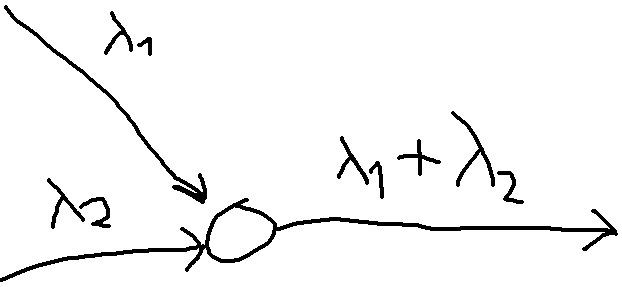

# MPI 3

## 1 wyk slajd 17

są dwa urządzenia

czas zajętości jeden ma rozkład wykładniczy z parametrem mi1 a drugi ma mi2

jaki jest rozkład jak jedno (obojętnie które) zostanie zwolnione?

no  i to jest zmienna losowa X

okazuje się że to też jest rozkład wykładniczy, ale z parametrem mi1+mi2

Czy mogę założyć, że długość pakietu w IP jest dana rozkładem wykładniczym? W praktyce tak zakładamy, ale trzeba uważać, bo wtedy też z pewnym p-stwem dlugość tego pakietu jest nieskończona (no bo to jest rozkład ciągły). No teoria kolejek ma takie przybliżenia, cóż matematyka to tylko narzędzie.

PRZYGOTOWUJĄC SIĘ NA KOLOSA SAMEMU WYPROWADZIĆ WZORY, KTÓRE SA NA SLAJDACH.

***

**Proces poissona (1)**

pierwsza własność - Dlaczego to ważna własność?

No bo jak mamy ruter i do niego przychodzą dwa źródła tak opisane to wypuszcza wtedy tak.

Wyprowadzenia tych wzorów są na kolosie 

Druga - to analogiczny symetrycznie odbity rysunek

Trzecia

Tam gdzie jest mniejsza zmienność to jest łatwiej - dlatego ATM tak miało. Bo wtedy przy tym samym napływie czas przepływu pakietu przez sieć jest najszybszy.

Zmiennośc oznacza, że jeśli patrzyymy na system to w pewnym momencie moze przyjść bardzo dużo i zapchać go, więc cieżko zwymiarować --> stałej długości pakiety dają lepszy obraz. 

***

**co chciałbym zebyście znali**

- M/M/1
  - podstawowy system który ulatwia analize sieci
- system ze stratami M/M/n/n
  - jeśli nie ma wolnych urządzeń obsługujących to pakiet/żądanie/klient zostaje stracony
- M/G/1 rozkład dowolny byle był dla każdego zadania taki sam
- M/G/1 z priorytetami

***

**System M/M/1**

Jaka jest własność że daje najmniejszy czas oczekiwania w systemie? Najpierw obsługuje pakiety krótki a te długie niech czekają, ta metoda daje najlepsze wyniki.

***

**System M/M/1 (2)**

Czyli np. ile klientów jest teraz w systemie. Czyli np. nie ma 0.1 klienta jak jest 1 klient, to potem moze być ich tylko 2 (nie 1.6 czy cos)

Albo że może przyjść naraz tyko jedno zadanie.

W systemie z czasem dyskretnym mamy ściśle określone momenty w których coś się może zdazyć, i tylko w nich może coś się zdarzyć

3) zależy tylko od stane anie od przeszłośći - to nazywamy ze jest **bezpamięciowy**

***

**Model sieci komputerowej**

To jest sieć kaskada przejść przez system M/M/1

Wyliczam wszędzie oddzielnie i potem czas oczekiwania to jest suma

co ja muszę założyć jeśli stosuje coś takiego? Proces napływu jest zgodny z poissonem, no więc wyjście też

Robimy założenie i teraz jakie sa konsekwencje tego założenia? Np. to ze w realu to nie jest poisson.

***

**Zastosowanie systemu M/M/1 do wyliczania ...**

Każdą kaskadę można analizować niezależnie.

