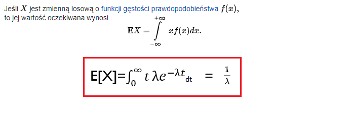
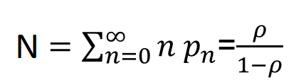
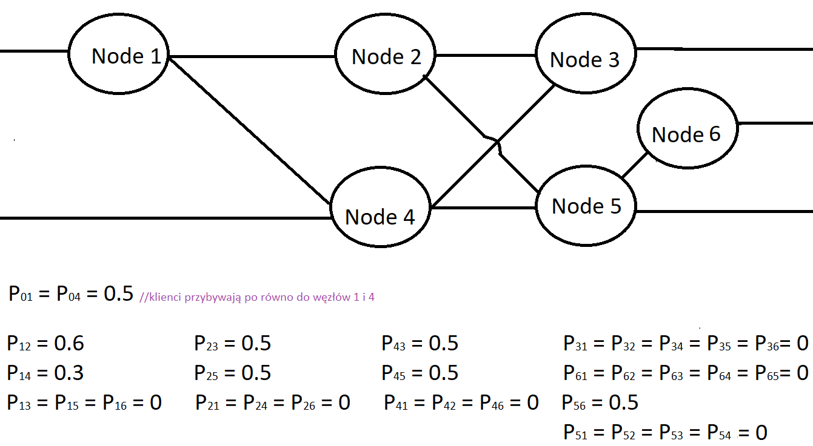
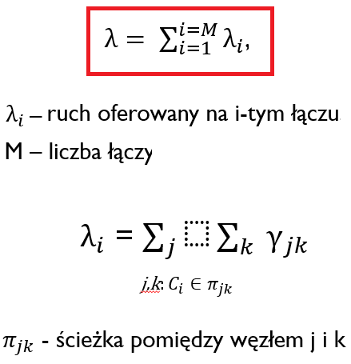
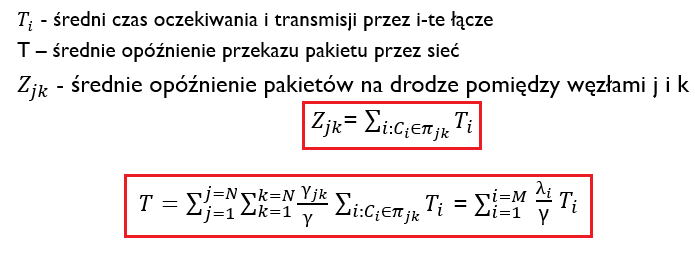
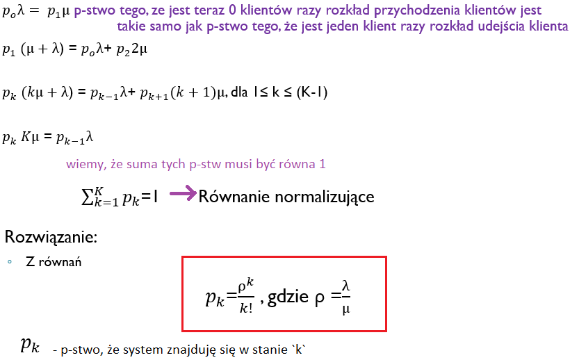

# Co będzie na kolosie

- [x] Jaki to system **M/D/n/K**?
- [x] Co to jest **sieć Jakcsona**?
- [x] Udowodnij, że rozkład wykładniczy jest **rozkładem bezpamięciowym**
- [ ] Wyprowadź zależność na średni czas oczekiwania pakietów obsługiwanych z niższym priorytetem w systemie **M/G/1** z dwoma priorytetami
- [x] Podaj **metryki** opisujące jakość przekazu pakietów przez sieć
- [x] Wyjaśnij czym charakteryzuje się rozkład **pod wykładniczy i nad wykładniczy**
- [x] Udowodnij, że strumień wyjściowy w systemie **M/M/1** jest opisany rozkładem Poissona 
- [ ] Wyprowadź zależność na średni czas oczekiwania w systemie **M/G/1**

Tematy z M/G/1 olewam* - najwyżej mi się trafi jedno pytanie z tego, więc lepiej już zrobić assert, że resztę umiem na 100%.

*Burak to jebany śmieć i te kurwa jego slajdy moze sobie w dupe wsadzić, nie ma nigdzie tego jego opisu M/G/1, literatury nie ma podanej, nie ma nic wyjaśnione, nie da się tego zrozumieć**, , a nie będe zakuwał na pamięć, bo kurwa nie od tego tutaj na ziemi jestem.

**wymyślenie własnej teorii, który mi to wyjaśni to kilka h

Tak jak on kurwa robi, to tak się nie uprawia nauki (pomylone oznaczenia, zero wyjaśnień, zero bibliografii) ja jebix ale mam wkurw xD Burak chuju jebany dostajesz statuetke pierwszego człowieka, który wyprowadził mnie z równowagi płci męskiej.

# Blok A

## Co będzie

- **Modelowanie ruchu w sieci Internet**, w tym w sieci *best* *effort* (model ARIMA, GARCH itd.), modelowanie ruchu generowanego przez różne typy aplikacji (wideo, mowa, dane) oraz znaczenie źródła ON/OFF. 

- **Użyteczne modele kolejkowe dla modelowania elementów Internetu**. Modelowanie elementów infrastruktury sieciowej i użyteczne algorytmy. Modelowanie elementów infrastruktury obliczeniowej i użyteczne algorytmy

- **Projektowanie klas usług „od końca do końca” w sieci gwarantującej jakość przekazu** **QoS/QoE** obejmujące metody matematyczne dla algorytmów przyjmowania/odrzucania wywołań, algorytmy szeregowania pakietów w węzłach, monitorowania ruchu, wielokryterialnego ruting między domenowy, …)

## 0. Plan

1. Wprowadzenie do QoS

2. Metryki QoS na poziomie pakietów

3. System obsługi

4. Rozkład Poissona

5. Rozkłady wykładniczy, pod wykładniczy i nad wykładniczy 

6. Inne ważne zależności

7. System z oczekiwaniem M/M/1 
   1. Proces Markowa
   2. Sieci Jacksona

8. System ze stratami M/M/n/n 
   1. Wzór Erlanga

9. System M/G/1

10. System M/G/1 z priorytetami 

## 1. Wprowadzenie do QoS


To co generuje sieć to ocenia/standaryzuje *"Y.1541 : Network performance objectives for IP-based services"*. Z tym, że poziom sieci widzi apka.

To co generuje apka to ocenia/standaryzuje *"ITU G.1010 End-user multimedia QoS categories"*. Z tym że poziom aplikacji "widzi" user.

To co widzi user to ocenia jego rozum, jego subiektywna ocena.


Strumień pakietów jak przejdzie przez sieć to:

- po pierwsze każdy z pakietów przyjdzie z jakimś opóźnieniem - **delay**
- po drugie dla każdego z pakietów wartość tego opóźnienia będzie inna - **delay jitter**
- po trzecie niektóre pakiety mogą się zgubić - **packet loss**
- po czwarte sieć jest w stanie przesłać tylko daną ilość pakietów w danym czasie - **throughput**

## 2. Metryki QoS na poziomie pakietów

### 2.1 IP Packet Transfer Delay (IPTD)

Zalecenie ITU-T Y.1540

**Dla danego pakietu** - jest to czas upływający pomiędzy chwilą wysłania pierwszego bitu a momentem odebrania ostatniego bitu pakietu w mierzonej sieci

Zazwyczaj wyrażane jest jako **parametry statystyczne próby*** 

- minimalne opóźnienie (min IPTD)
- maksymalne opóźnienie (max IPTD)
- średnie opóźnienie (mean IPTD)

*próba - wielokrotnie powtórzony eksperyment "dla danego pakietu"


> Uwagi:
>
> - Min i Max IPTD wynikają z przepływności łączy, wielkości buforów i długości pakietów
>
> - Mean IPTD zależą od przepływności łączy, wielkości buforów, długości pakietów i <u>ruchu w sieci</u> 

### 2.2 IP Packet Delay Variation (IPDV)

> Inaczej Delay Jitter

Zalecenie ITU-T Y.1540

**Dla danego pakietu** jest zdefiniowane jako różnica IPTD tego pakietu i pewnego pakietu, którego IPTD jest traktowane jako punkt odniesienia. Punktem odniesienia może być IPTD pierwszego pakietu w strumieniu, najmniejsze IPTD w próbie lub średnie IPTD w próbie

**Dla danego zbioru pakietów** to różnica pomiędzy kwantylem rzędu (1-a) rozkładu opóźnienia przekazu pakietów IPTD  `minIPTD` w danym przedziale czasu, np. a=10-3


### 2.3 IP Packet Loss Rate (IPLR)

Zalecenie ITU-T Y.1540

**Dla danego zbioru pakietów** to stosunek liczby pakietów straconych do liczby pakietów wysłanych w danym okresie pomiarowym

Za stracone uznaje się pakiety pomiarowe które nie dotarły do odbiornika przed upływem czasu `Tmax` (zalecane 3s).

> **Uwaga -** dla niektórych aplikacji, zbyt duże opóźnienie pakietów uważa się za ich stratę

### 2.4 Throughput

Przepłwność

Liczba przesłanych pakietów (od danych długościach) w danej jednostce czasu, liczona na poziomie aplikacji

> czyli liczone są pakiety, które został odebrane przez apke odbiorcy

> Ważne dla przekazu dużych ilości informacji z wykorzystaniem np. protokołu TCP, gdzie istotnym parametrem jest np. gwarancja minimalnej szybkości przekazu

### 2.5 Przykładowe wymagania apek


## 3 System obsługi

### 3.1 Intro


Klientami mogą być pakiety lub zadania (calls) do wykonania przez serwer obsługi

Metody badawcze:

- teoria kolejek
- metody symulacyjne

### 3.2 Klasyfikacja systemów obsługi

Systemy obsługi klasyfikujemy ze względu na opisujące je charakterystki:

- **Napływ klientów do systemu**
  - `A` w notacji Kendall'a
- **Zachowanie klienta w kolejce** 
  - czy będzie cierpliwie czekał, czy będzie rezygnował 
- **Czas obsługi klientów przez serwer**
  - `B` w notacji Kendall'a
- **Ilość serwerów obsługi** 
  - `n` w notacji Kendall'a
- **Pojemność kolejki**
  - `K` w notacji Kendall'a
  - czy kolejka jest nieskonczona, czy skończona 
- **Liczba klientów korzystających z systemu obsługi**
  - `S` w notacji Kendall'a
- **Kolejność obsługi klientów**
  - czy FIFO, czy dzielenie strumieni na priorytety 
  - `X` w notacji Kendall'a

### 3.3 Notacja Kendall'a

A/B/n/K/S/X

określają kolejno:

A) Napływ klientów do systemu

B) Czas obsługi klientów przez serwer

n) Ilość serwerów obsługi 

K) Pojemność kolejki (pominięty oznacza kolejkę nieskończoną)

S) Liczba klientów korzystających z systemu obsługi (population size)

X) Queueing discipline 

Jak można je wypełnić?

`A` i `B`:

- `M` - Markovian -  rozkład czasów między zdarzeniami taki jak w Procesie Poissona - rozkład wykładniczy

- `D` - Determinitic - rozkład Stały

- `G` - General -  Arbitrary distribution of time intervals (may include correlation).

`n`:

- liczba całkowita

`K`:

- liczba całkowita
- pominąć - wartość nieskończona

`S`:

- liczba całkowita
- pominąć - wartość nieskończona

`X`

- FIFO - First In First Out
- LIFO - Last in First Out
- SIRO - Service in Random Order

Przykłady:


## 4 Proces Poissona

Type of random mathematical object that consists of points randomly located on a mathematical space.

The process has convenient mathematical properties, which has led to its being used as a mathematical model for seemingly random processes in numerous disciplines: w tym telco.


A visual depiction of a Poisson point process starting from 0, in which increments occur continuously and independently at rate `λ`.

Czyli kolejne *punkty* pojawiają się losowo, ale średnio co `λ`. Więc jak weźmiemy wygenerujemy 100000 punktów procesem Poissona, to średnia odstępów między nimi wyjdzie `λ`. Mimo, to każdy kolejny odstęp generowany jest niezależnie, tzn. gdy `λ=2` i poprzedni odstęp był `1` to nie ma specjalnego mechanizmu, żeby teraz odstęp był `3`.

Podsumuwujac: a process in which events occur continuously and independently at a constant average rate

Summarizing: proces, w którym zdarzenia występują w sposób ciągły i niezależny ze stałą średnią intensywnością

## 5 Rozkład wykładniczy

Rozkład prawdopodobieństwa czasów pomiędzy zdarzeniami/punktami w procesie Poissona.


> Funkcja gęstości p-stwa - to f-cja, taka że całka z tej funkcji, obliczona w odpowiednich granicach, jest równa prawdopodobieństwu wystąpienia danego zdarzenia losowego
>
> Dystrybuanta - funkcja taka, że dla danego parametru `t`, określa p-stwo, ze zmienna losowa dla której jest określona ta dystrybuanta będzie mniejsza od `t`. ===> `Fx(t) = P(X < t)`

### 5.1 Bezpamięciowość


> Czyli jak idziesz na przystanek gdzie autobusy przybywają zgodnie z rozkładem Poissona co λ = 3 minuty, i czekasz już 2 minuty, to kiedy się spodziewać autobusu? Za minutę? No właśnie nie - rozkład nie ma pamięci, więc nie ma nigdzie zapisane, że już mineły 2 minuty i za minutę powinien dać autobus. Cały czas, czas oczekiwania na autobus wynosi 3 minuty. Więc jak już czekasz 2 minuty, to autobusu spodziewaj się za 3 minuty.
>
> Pomogła mi siostra Ania :smile:

#### Dowód


!!! Tu jest błąd malutki. w ostatniej linijce przed implikacją ostatnia równość powinna być:

```
1-F(t1) = P(x>t1)
```

### 5.2 Zmienność rozkładu

#### Wartość średnia/oczekiwana



#### Wariancja


#### Współczynnik zmienności


### 5.3 Inna własność


Burakowi po prostu chodziło o tę własność:


## 6 Rozkłady pod i nad -wykładnicze

### 6.1 Podwykładniczy (hypoexponential)

Inaczej zwany Generalized Erlang Distribution.

Nazwa "pod" się bierze stąd, że *współczynnik zmienności* jest mniejszy od 1 (a wykładniczy ma równy 1).


Czyli jest to po prostu rozkład zmiennej losowej, która jest sumą zmiennych losowych danych rozkładem wykładniczym. 


### 6.2 Nadwykładniczy (hyperexponential)


Czyli mamy kilka zmiennych losowych `Yi` danych rozkładem wykładniczym. i robimy teraz zmienną, która dla każdego `x'a` jest sumą wartości `Y'greków` pomnożonych przez p-stwo ich wystąpięnia. Zauważ, że ciąg `pi` musi się sumować do 1. 

Układ, który prezentuje działanie:


Nazwa "nad", bo ma *współczynnik zmienności* większy od 1.


### 6.3 Zestawienie

Nadwykładniczy ma dużą zmienność, podwykładniczy dąży do stałego.

Rozkład stały ma *współczynnik zmienności* równy 0.

## 7 Ograniczenia na wartość kwantylu rozkładu

### 7.1 Ograniczenie Markova


> To używamy gdy znamy jedynie wartość oczekiwaną

### 7.2 Ograniczenie Czebyszewa


> To używamy gdy znam wartość oczekiwaną i wariancję rozkładu

## 8 Proces Poissona

>  Opis w [rodziale 4](#4-proces-poissona), który był wstępem do rozkładów wykładniczych itp.. Ten rozdział przedstawia opis matematyczny i właściwości.


Dystrybuanta `(P(X<ʎ*t))`

Jak ją czytać?

Najpierw niebieska dla K=0. Czyli to nami mówi jakie jest p-stwo, że do systemu przyjdzie 0 zadań. Jak widać, jak czas mija, to ona spada. No bo to logiczne. I w przypadku 5 sekund, to już jest prawie zerowe p-stwo że nie pojawi się żadne zadanie w systemie.

### 8.1 Własności

- Suma dwóch rozkładów Poissona o parametrach  `ʎ1` i `ʎ2` jest rozkładem Poissona o parametrze `ʎ1+ʎ2`.
  - 

- Proces Poissona o parametrze `ʎ1+ʎ2` rozdziela się na dwa strumienie Poissona o parametrach `ʎ1` i `ʎ2` , jeżeli przynależność do poszczególnych strumieni losujemy z prawdopodobieństwami: `ʎ1/(ʎ1+ʎ2)` , `ʎ2/(ʎ1+ʎ2)`.
  - 

- Jeżeli przychodzi zadanie do systemu zgodnie z rozkładem Poissona, wówczas zastaje system w stanie losowym (jak wynika z rozkładu prawdopodobieństwa występowania stanów) – stąd PASTA (*Poisson* *Arrivals* *See* *Time* *Averages*)
  - Arrival Theorem
    - "Upon arrival at a station, a job observes the system as if in steady state at an arbitrary instant for the system without that job"
    - "W momencie przybycia, job widzi system tak samo jak w stanie ustalonym w danej chwili czasowej bez job'a"
  - Arrival Theorem for Poisson process
    - "The probability of the state as seen by an outside random observer is the same as the probability of the state seen by an arriving customer".
    - "P-stwo obserwacji danego stanu systemu przez zewnętrznego obserwatora jest takie samo jak p-stwo obserwacji tego stanu przez przybywające do systemu klienta"

### 8.2 Zmienność

#### Wartość średnia


#### Wariancja


#### Współczynnik zmienności


## 9 Prawo Little'a


N - long-term average count of customers currently residing in the system

ʎ - long-term average rate of arrival

T - long-term average time that client spends in a system

## 10 Wzór na p-stwo straty

W systemach gdzie klient jest odrzucany, gdy nie ma dla niego serwera obsługi


> To logiczne. P-stwo straty jest takie samo jak to, że serwer jest zajęty - czyli `ρ`, ale Burak robi specjalnie pod górkę.

## 11 Systemy obsługi

Plan:

- System z oczekiwaniem M/M/1 

  - Proces Markowa

  - Sieci Jacksona

- System ze stratami M/M/n/n 
  - wzór Erlanga

- System M/G/1

- System M/G/1 z priorytetami 

## 12 M/M/1

- Jeden serwer obsługi
- Nieskończona liczba miejsc w kolejce
- Queue Discipline: FIFO
- Klienci przychodzą do systemu zgodnie z rozkładem Poissona z parametrem λ
- Czas obsługi każdego klienta jest dany rozkładem wykładniczym z parametrem µ


> Ten wzór jest izi. Dajmy, że ʎ = 1/2 i µ = 1. Czyli klienci przybywają co 2 sekundy i jeden obsłużony jest co sekundę (średnio w makroskali, ja tu upraszczam). Czyli przyszedł klient w sekundzie 0, serwer wziął go do obsługi co trwało sekundę i potem aż do drugiej sekundy nic się nie dzieje. Czyli w tym interwale serwer przez 1s obsługiwał, a przez 1s nie. ==> czyli był zajęty 50% czasu. Potem w 2s znowu przyjdzie pakiet i akcja się powtarza. I tak K***A do za**bania.

### 12.1 Procesy Markova

Ten zbiór własności systemu M/M/1 wynika z tego, że jest on możliwy do opisania poprzez proces Markova

- System może być jedynie w jednym ze stanów k, k=0,1,2…
  - Stan systemu to między innymi liczba klientów w nim. I to nie może być np. `1.2` klienta. Po `1 klient` sąsiednie stany to `0 klientów` lub `2 klientów` - nie ma nic pomiędzy. 

- System może przejść z jednego stanu jedynie do stanu sąsiedniego , np. ze stanu k do stanu k+1
  - Po `1 klient` sąsiednie stany to `0 klientów` lub `2 klientów`. Na raz nie może przyjść dwóch klientów - tylko jeden.

- Prawdopodobieństwo przejścia z danego stanu do stanu sąsiedniego zależy jedynie od akutalnego stanu a nie od przeszłości
  - Układ bezpamięciowy

- Czas przebywania w danym stanie dany jest rozkładem wykładniczym
  - Tak, bo stan systemu opisuje liczba klientów, a skoro przybywają i opuszczają oni system zgodnie z rozkładem wykładniczym oraz (z własności Poissona) suma tych rozkładów też daje wykładniczy, no to ten ... zgadza się

- Proces Markowa z czasem ciągłym oznacza, że przejście z danego stanu do stanu sąsiedniego może się odbyć w dowolnej chwili 
  - Z czasem dyskretnym by było, że tylko w określonych chwilach


### 12.2 Własności 

Spróbujmy policzyć ile jest średnio klientów w systemie. Żeby potem przeszktałcić prawo Little'a i wiedzieć jaki jest *średni czas przebywania klientów w systemie*.


No to dajmy ile jest klientów w chwili, gdy `t` dąży do nieskończoności, czyli symulacja trwa już bardzo długo, że to już się ustaliło (stan ustalony, stacjonarny).


Z czego to wynika?


Gdzie `ρ` to obciążenie systemu. 

Czyli liczba klientów w systemie jest dana ciągiem geometrycznym. Ze wzorów na ciąg geometryczny wychodzi nam zatem **średnia liczba klientów w systemie**.



Przekształcamy teraz prawo Little'a, żeby wyszło nam **średni czas przebywania klienta w systemie**


I na koniec **średni czas oczekiwania**. Czyli mnożymy czas spędzony w systemie przez zajętość serwera. Co jest logiczne. Zajętość serwera, to liczba od 0 do 1 - i mówi, że przez tyle procent czasu serwer jest zajęty, więc jak klient spędza w systemie T czasu to `ρ` procent tego czasu spędza w kolejce.


### 12.3 Strumień wyjściowy


#### Dowód

Rozważmy system M/M/1 o ʎ = 1/2 i µ = 1. Czyli klienci pojawiają się średnio co 2 sekundy a serwer obsługuje ich w sekundę. Dla uproszczenia wyobraźmy sobie, że wariancja rozkładu jest 0 (no ja wiem, że to przeczy założeniom xd, ale chodzi mi o to, że w makroskali).

Jak opiszemy rozkład który dzieję się na wyjściu?

W momentach, w których kolejka jest niepusta (**Busy period**) i serwer jest non-stop busy pakiety opuszczają system co sekundę. Czyli rozkład wykładniczy z parametrem µ.

W momentach, w których kolejka jest pusta (Non-busy period) najpierw musimy "poczekać" aż przyjdzie pakiet a potem odczekać "one service time".  Czyli tak jakby co 3 sekundy.

Wiemy też, że Busy -period występuje `ρ` procent czasu, a Non-busy period `(1-ρ)` procent czasu.

Nie wiem jak to zapisywane jest w dziedzinie czasu, ale transformata Laplace'a tej funkcji to:


Co wydaje się sensowne, bo pierwszy człon (Busy period) to sam rozkład `µ`, a drugi człon (Non-busy period) to rozkład `ʎ` (czekanie aż przyjdzie klient) i rozkład `µ` (jego obsługa).

Po wymnożeniu nawiasu i uproszczeniu wychodzi nam taka postać transformaty `(LD(s))`


,która (ja nie wiem jak) przechodzi na taką funkcję w dziedzinie czasu `D(t)`. 

A taka funkcja (w sensie to `D(t)`) to nic innego jak gęstość rozkładu wykładniczego :smiley: (==> czyli proces Poissona)


Wychodzi na to, że klienci opuszczają system M/M/1 zgodnie z rozkładem Poissona. Co jest podstawą sieci Jacksona o których za chwilę...

## 13 Sieć Jacksona

Sieć Jacksona składa się z `M` węzłów, gdzie każdy węzeł reprezentuje jeden system M/M/1.

Klienci (zadania/jobs) podróżują między węzłami na podstawie ustalonych tablic rutingu.

Queing discpline w każdym węźle to FIFO.

Sieć może być otwarta, czyli klienci napływają do sieć z zewnątrz i wypływają z niej na zewnątrz.




## 14 Analiza opóźnień w sieci pakietowej

### 14.1 Ruch generowany w sieci


### 14.2 Ruch oferowany w sieci



### 14.3 Średnie opoźnienie



### 14.4 Problem wyznaczenia przepływności łączy

Tutaj Burak odleciał xd


## 15 M/M/n/K - systemy ze stratami


- Klienci przybywają zgodnie z rozkładem Poissona z parametrem `ʎ`
- Każdy klient żąda jeden serwer obsługi

- Czas obsługi klienta jest dany rozkładem wykładniczym z parametrem `µ`
- Jeżeli klient przybędzie do systemu i nie ma wolnego serwera obsługi, to klient jest tracony

### 15.1 Stan systemu

Stan systemu określony jest przez liczbę klientów.


> Zauważ ze system równocześnie obsługuje kilku klientów, więc jak przyjdzie klient do systemu gdzie już jest jeden, czyli stan obecny systemu to 2 klienci, to szansa ze zaraz stan zmieni się o jeden w dół jest dwukrotnie większa, bo system obsługuje dwóch klientów naraz. 
>
> Dlatego powroty o stan niżej dzieją się szybciej.
>
> Przykład  ʎ = 1 i µ = 1. Mamy stan=1. W tym stanie możliwe, że zaraz (z rozkładem `µ`) serwer zakończy obsługę tego jednego klienta i system wróci do stanu 0. Jak teraz do systemu wbije klient, to stan się zwiększy na `2`, ale ten klient od razu jest obsługiwany, więc teraz system równolegle obsługuje dwóch klientów, czyli z powrót do stanu=1 dany jest rozkładem `2µ`. 

### 15.2 P-stwa na stany

Chcemy wyznaczyć wzór, na p-stwo, że system znajduje się w danym stanie.



### 15.3 P-stwo straty


## 16 System M/G/1


### 16.1 Z priorytetami


Czyli jak widać korzystamy ze wzoru na górze i wychodzi nam czas obsługi strumienia `i=1`, na który składa się średni czas czekania w kolejce klientów ze strumienia `i=1` oraz resztkowy czas obsługi wszystkich strumieni.

Jeśli chodzi o strumień `i=2` to tu mamy czas czekania w kolejce klientów ze strumieni `i=1` oraz `i=2` napływ (ten iloczyn z `W2`) do kolejki strumienia `2` (w `i=1` tego nie było, bo one nie czekały tylko odrazu do obsługi) oraz również resztkowy czas obsługi innych strumieni.

