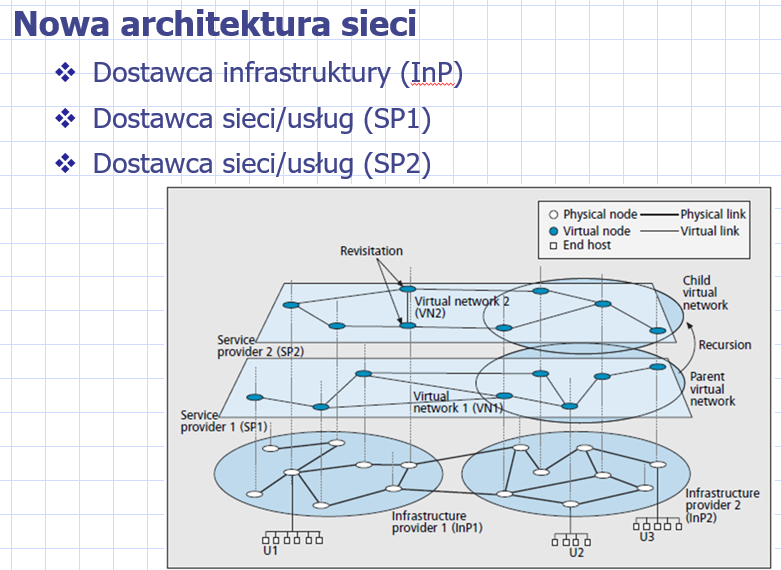
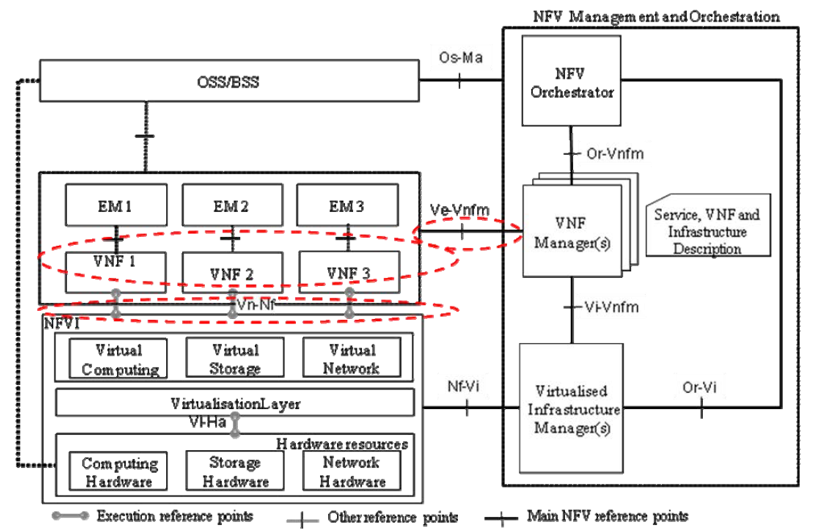
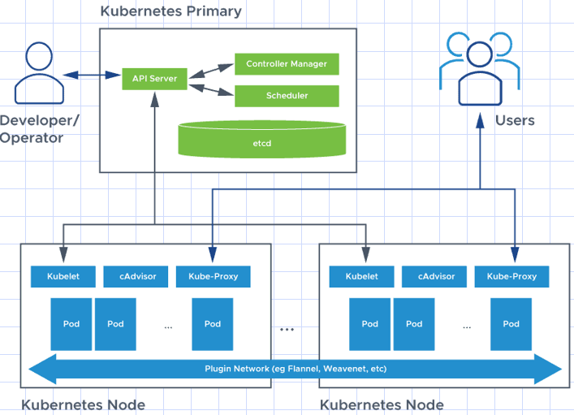
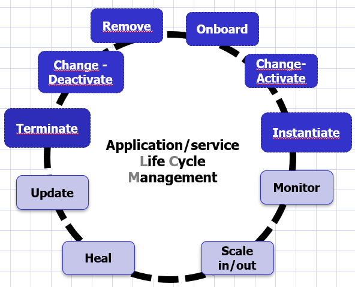
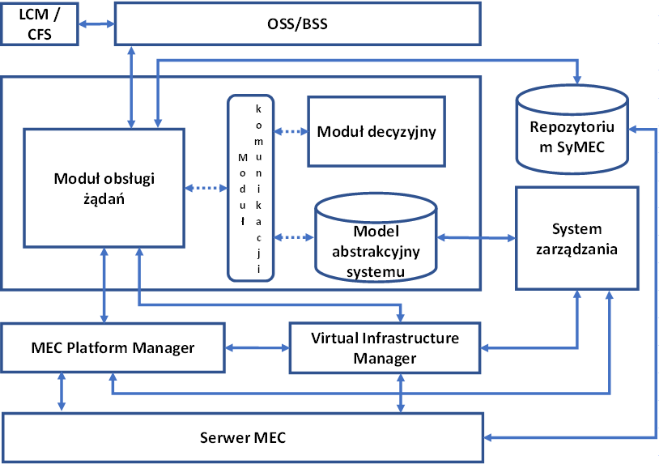
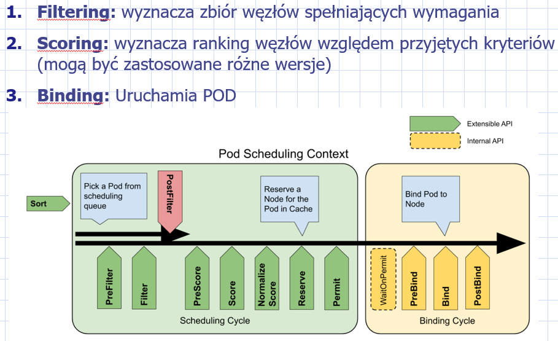
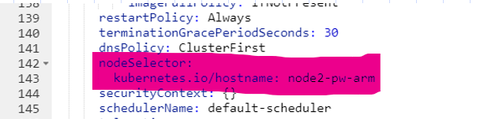
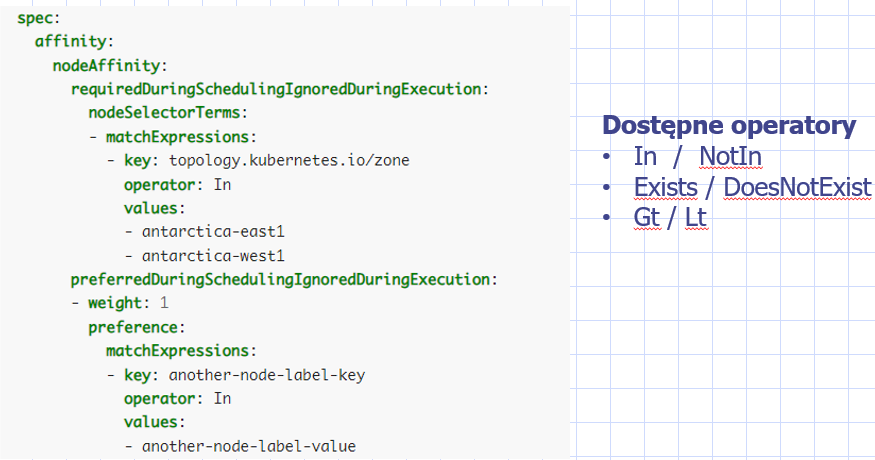
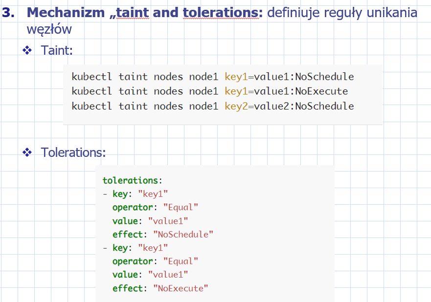

- [x] Na czym polega NFV, architektura i główne komponenty na przykładzie ETSI MANO. Przyczyny czemu sieci ewoluują w tym kierunku.
- [x] Cel i zasada działania edge computing. Różnica między fog, edge oraz MEC. Architektura MEC i przykładowe zastosowania
- [ ] Jakie są i naczym polegają modele świadczenia usług wykorzystujących technikę chmur obliczeniowych. Kiedy ją stosujemy i dlaczego może być opłacalne. Omów jej ograniczenia i zagrożenia.
- [x] Czym jest orkiestracja. Podstawowe funkcje. Czym różni się od zarządzania. Czym różnią się funkcje orkiestracji w centrach danych od systemów obliczeń na brzegu sieci
- [ ] Zadanie optymalizacyjne - MEC
- [ ] Zadanie optymalizacyjne - CDN
- [ ] Zadanie optymalizacyjne - VNF
- [ ] Zadanie optymalizacyjne - to inne

# Wprowadzenie

## Nowe Techniki

### Wirtualizacja infrastruktury - NFV

NFV - Network Function Virtualization

Koncept architektury sieciowej wykorzystujących technologie wirtualizacji wykorzystywane w IT. Wirtualna funkcja sieciowe (VNF - Virtual Network Function) jest zaimplementowana jako maszyna wirtualna lub jako kontener. https://en.wikipedia.org/wiki/Network_function_virtualization#History

Czemu sieci ewoluują w tym kierunku, na co to pozwala?



Na odzielenie ról, nowe modele biznesowe i na elastyczność.

> InP to na przykład Cellnex

> Nie jesteśmy zależni od hardware jebać ciscoi juniper. Co z wydajnością jeśli to soft? Generalnie jak jest sam soft to wydajność spada.
> UPF 
> Ale mamy zrównoleglenie, więc stawiam bardzo dużo UPFów ograniczonych i no nawet w worst case niech będzie że jeden UPF na jedno połączenie
> Drugi trend to wspieranie hardwarem i właśnie na tych Infra są te rzeczy udostępnione.

Głowne cechy tego rozwiązania:

- **elastyczność** - Każdy SP powinien mieć możliwości stworzenia dowolnej topologii sieci, rutingu i metody przekazu danych i mieć możliwość zaimplementowania protokołów sterowania niezależnych od sieci fizycznej i innych VN.

  - >  Protokół IP jest passe i dzięki wirtualizacji jak ktoś wpadnie na super pomysł nowego protokołu to łatwiej to zaimplementować.

- **ułatwione zarządzanie** - wprowadzenie modularności zarządzania siecią – zarządzanie na każdym poziomie.

  - > Więc wydajność gorzej, ale poprawiamy to jak się da (wspieranie hardware'em) i tak już nie ma odwrotu od NFV Bo jest proste zarządzenie itp a ten spadek kompensujemy.
    > Łatwiej się zarządza ale skomplikowanie jest większe w sensie zrozumieć to wszystko jest trudniej 

No ok, ale NFV to architektura, jak więc ona wygląda?

Na rysunku widzimy jeden node, na którym odpalone jest 3 funkcje sieciowe, a obok dołączone do tego node'a są systemy Management and Orchestration.



**OSS/BSS** - to co u operatora telco najważniejsze - charging, policy itp.

**EM** - Element Management. Czyli coś co zarządza lokalnie danym elementem. Jakiś agent **VNF Manager**?

**VNF** - Virtual Network Function - czyli to co jest wirtualizowane, gwóźdź programu

**Virtualisation Layer** - warstwa odpowiedzialna za wirtualizację - VirtualBox, VMware, Docker, kvm, conteinerd

**NFV Orchestrator** - dwie funkcje:

- orekiestracja zasobów infrastruktury across wiele Virtualised Infrastrucure Manager 
- zarządzanie cyklem życia usług

**Virtualised Infrastructure Manager** - sterowanie i zarządzanie NFVI (infra) compute, storage and network resources. Np. Kubernetes tym jest.

**VNF Manager** - zarządzanie cyklem życia instancji VNF. Management and orchestration aspects of a VNF include traditional Fault Management, Configuration Management, Accounting Management, Performance Management, and Security Management (FCAPS).

### Software Defined Network

TODO

### Cloud Computing

TODO

### Edge/Fog Computing

TODO

## Kubernetes



### Primary/Master Node

#### kube-apiserver

Dostarcza operacje REST za pomocą, których odbywa się cała komunikacja. Jest punktem wspólnym dla innych komponentów. Waliduje i konfiguruje*  wymieniane dane między komponentami.

*zlecamy mu operacje opisaną krótko, a on zajmuje się wypełnieniem reszty logiki (poprzez zapytania do innych komponentów np.) Np. powiemy mu pokaż mi jakie są node'y a on wtedy odezwie się do Controller Manager i domyśli się jakie pola tych node'ów chcemy zobaczyć (że nazwa, cpu, ram, zajętość), Controller Manager mu odda i API Server nam zwróci.

Generalnie to on jest gościem, który obsługuje procesy zarządzania i orkiestracji. Wszystko odbywa się za jego pomocą. kube-cli to tak naprawdę te komendy są zamieniane właśnie na zapytania REST i lecą do kube-apiserver

#### kube-controller-manager

To tu zaimplementowane są *control loops*, które regulują stan klastra. Dąży on aby current state stał się desired state. Zleca w tym celu za pomocą kube-apiserver różne operacje.

#### Scheduler

Jak trzeba odpalić nowego poda, to on właśnie przypisuje węzeł dla tego poda.

#### etcd

Baza danych, która przechowuje konfigurację klastra. K8s jest stateless, jakby nagle padł to tu jest wszystko zapisane.

### Worker node

#### kubelet

Jest na każdym worker node, agent sterowania. Rejestruje węzeł w klastrze oraz zapewnia komunikację z kube-controller-manager poprzez nasłuchiwanie na polecenia z kube-apiserver

#### kube-proxy

Zapewnia komunikacje sieciową między worker node a environment. To za jego pomocą serwisy na podach mogą komunikować się ze sobą, oraz są dostepne dla użytkowników.

#### Container runtime

Uruchamia Pody. Docker lub Containerd.

#### CAdivsor

Zbiera statystki o węzłach i serwisach na nich uruchomionych

# Orkiestracja

Orkiestracja to proces, który uruchamia się w celu zarządzania cyklem życia usługi/aplikacji.

Jest to proces realizowany w różnych skalach czasu. Onboard zdarza się relatywnie rzadko (raz na kilka dni), a Instantiate co kilka ms nawet.



Historyjka: Mamy jakieś Data Center, które oferuje mnóstwo resources (CPU, RAM itd.). Klienci biznesowi jak Ceneo.pl, Kurnik.pl zamiast samemu utrzymywać serwery ze swoimi aplikacjami to mogą dogadać się z Data Center. Załóżmy, że jest jakieś Data Center w Poznaniu należące do firmy Equinix. Kurnik.pl ma dość hostowania swoich gierek na własnych serwerach i idzie do Equinix i mówi "mordy weźcie mi no hostujcie moje apki". Equinix pierwsze o co pyta to "Daj mi w takim razie byku (kurko hehe) container-images tych swoich apek". No i w momencie, gdy Kurnik przekaże do Equinix swoje obrazy apek, a Equinix sobie je wgra w Kubernetes (a dokładnie to w jakieś obrazowe repo) to to jest **onboarding**. Potem Equinix powie swojemu K8s ile tego typu apek potrzeba, zdefiniuje wymagania na zasoby dla jednej instancji z tego obrazu i od tej pory K8s będzie mógł je instancjonować - to się nazywa **Activate**. Jak już obraz jest aktywny, to gdy przyjdzie żądanie użytkowników na daną usługę to K8s postawi Pod a w nim uruchomi kontener z obrazu danej usługi i to się nazywa **Instantiate**. Czyli np. ktoś (Michał z Kacprem) chce zagrać w chinćzyka, to wtedy jak na tej stronie https://www.kurnik.pl kliknie "CHIŃCZYK (476)" to w tym momencie K8s dostanie że jest request na gierke w chinola i zinstancjonuje kontener na ten cel. Ten kontener będzie hostował grę jakiś tam dwóch osób. Potem chcielibyśmy, żeby jak już kontener żyje to było wszystko z nim ok i żeby zachować ciągłośc usługi (czyli żeby gierka w chinola nagle się nie wyjebała). Od tego jest **Monitor**, czyli paczymy czy jest wszystko ok. Jak Michał i Kacper nagle zacznie klikać jak dziecko z ADHD i będzie potrzeba więcej zasobów na ten kontener (lub wgl drugi kontener) to zadzieje się **Scale in/out**. Jak kontener się popsuje to będzie **Heal**. **Update ** to nie wiem o chuj chodzi. Jak Kaceprek i Michałem skończą partię i nie bedą chcieli kolejnej w chińczyka, to Orkiestrator zrobi na tym kontenerze **Terminate**. Jak Kurnik.pl zdecyduje się na zupełne wycofanie ze swojej oferty Chińczyka (bo to debilna gra), to Poprosi o **Deactivate**, czyli żeby cofnąć Activate. **Change** jakby chcieli podmienić obraz, czyli naprzykład dać inne zasady gry czy coś. Na koniec Equinix ususwa obraz - **Remove**.

## Funkcje orkiestratora

Główne:

- **Service/application instantiation /termination** – obsługa żądań użytkowników

- **Service/application onboarding/removing** - obsługa żądań dostawcy usług
- **Activate/de-activate**

Wspierające:

- Monitorowanie stanu usług (czy każda usługa ma odpalone tyle kontenerów, ze pokrywają one zainteresowanie)
- Skalowanie wydajności usług (jeśli nie to proszę odpalić kolejne pody)
- Obsługa mobilności aplikacji (czyli zachowanie ciągłości obsługi mimo, ze kontener przelazł z jednego węzła na nowy)
- Automatyczna aktualizacja oprogramowania (czyli jak producent kontenera chińczyka wydaje nową wersję, to niech orkiestrator zrobi update)
- Zarządzanie zasobami wykorzystaniem (CPU, GPU, RAM, Sieć, energia)
- Zapewnienie niezawodności i obsługa awarii (Heal)

### Obługa żądań dostawcy usług

Co potrzebujemy:

- **Model zasobów data center**, 

  - czy aplikacja może być udostępniona w przyszłości (czy są zasoby, czy starczy QoS, czy obraz jest zgdony z oprogramowaniem)
  - Zasoby Serwerów/Węzłów

- **Model aplikacji**

  - Deskryptor aplikacji (zasoby + wymagania)
  - Obrazy aplikacji

- **Funkcje decyzyjne**

  - Przyjęcie i umieszczenie/odrzucenie obrazu w repozytorium obrazów

### Obsługa żądań użytkowników
Co potrzebujemy:
- **Model zasobów data center **
  - Czy aplikacja może być teraz uruchomiona
  - Topologa Węzłów
  - Zasoby Węzłów
  - Instancje aplikacji - stan (uruchomiona, w repozytorium, niedostępna)

- **Model aplikacji**
  - Deskryptor aplikacji (zasoby + wymagania)
  - Obrazy aplikacji w repozytorium

- **Funkcje decyzyjne**
  - Przyjęcie (żadania na usługę) i umieszczenie/odrzucenie (instancji)

- **Zasady przekierowania ruchu do aplikacji**

## Architektura orkiestratora



https://www.linkedin.com/pulse/mec-101-primer-communications-service-providers-sandeep-sahu/

https://www.symec.com.pl/pl/elementy-systemu-symec/architektura-systemu-symec/

**LCM - LifeCycle Management, CFS - Customer Facing Service** - to stąd może przyjść żądanie zarówno od dostawcy jak i user'a

**OSS/BSS** - Operations Support System / Business Support System - najpierw zweryfikujemy czy ten ktoś ma wykupione u nas usługi itp.

**Moduł obsługi żądań** - Tu przychodzi żądanie. Najpierw sprawdzi on czy są zasoby wykonując zapytanie do **Model abstrakcyjny systemu** i na tej podstawie podejmie decyzje posiłkując się **Modułem decyzyjnym**. Gdy decyzja jest pozytywna  zwraca się on do **MEC Platform Manager** i **Vritual Infrastrcuture Manager** (czyli np. K8s), zeby zadziało się co trzeba (powstał odpowiednie pody).

**Repozytorium SyMEC** - przechowuje obrazy aplikacji 

## Proces orkiestracji K8s

No dobra, zawrócił się do nas ten **Moduł obsługi żądań** co teraz robi K8s, żeby postawić poda, a dokładniej to co robi kube-scheduler, bo to on decyduje gdzie stawiać pody (i mówi, ale sam nie stawia).

Robi o to:



### Wpływ na wybór węzła

W jaki sposób my jako K8s Admin, możemy wpływać na wybór węzła?

#### NodeSelector

W pliku konfiguracyjnym pod, po prostu podajemy hostname



#### NodeAffinity

Do węzłów możemy przypisywać jakieś *label'e*.

A potem z nich korzystać w pliku konfiguracyjnym pod o tak:



#### Taints and tolerations



To jest ciekawy mechanizm. Wyobraźmy sobie, że node'y to ludzie, a pody to zwięrzęta (np. komar bo komar to jest zwierze). No i teraz żeby jakieś zwięrzęta na nas nie siadały to możemy popsikać się sprayem. Są różne spraye na komary, na muchy, na szerszenie i np. komar jest tolerant na spray na muchy ale na spray na komary już jest intolerant. Tak samo tutaj: node'om definiujemy jaki mają taint (jakim sprayerm ich psiknęliśmy), a potem jak tworzymy pod to mówimy mu na jakie tainty (spraye) jest on tolerant.

# Generalized Assignment Problem

## Definicja

GAP: Przypisać zbiór VM/Podów do zbioru węzłów. Ograniczeniem jest to, że każdy VM/Pod musi być przypisany dokładnie do jednego węzła, oraz że zasoby konsumowane przez VM/Pody przypisane do jednego węzła nie mogą przekroczyć jego pojemności.

## Model

```python
# ----------------------- P A R A M S ---------------------------
param N, integer, >0;           # number of nodes
param P, integer, >0;           # number of VM/Pods'

set nodes:=1..N;
set pods:=1..V;

param resConsumed{p in Pods, n in Nodes} 	# resources consumed in allocating pod `p` to node `n`
param capacity{n in N}                   	# resource capacity of node `n`
param cost{p in Pods, n in Nodes}        	# cost of allocating pod `p` to node `n`
# ----------------------- V A R I A B L E ---------------------------
var x{p in Pods, n in Nodes}             	# x[p,n] means Pod `p` is assigned to node `n`
# ----------------------- S U B J E C T  T O ---------------------------
Subject to one{n in Nodes}:					# VM j must be assigned exactly to one server	
    sum{p in Pods} x[p, n] = 1;	
Subject to limit{n in Nodes}:				# total resources consumed by all pod assigned to node must not exceed its capacity
    sum{p in Pods} resConsumed[p,n] * x[p,n] <= capacity[n];
# ----------------------- O B J E C T I V E ---------------------------
Minimize obj:
    sum{n in Nodes, p in Pods} cost[p,n]*x[p,n] 	# the objective is to find cheapest assignment 
```

## Zarządzanie rozpływem ruchu

### Definicja

Jak w GAP uwzględnić rozpływ ruchu?

- Wymagana znajomość topologi datacentrów/węzłów
  - Lokalizacja userów
  - Lokalizacja data centrów
  - Charakterystyka przekazu pomiędzy data centrami (przepływność bitowa, delay)
- Wymagana znajomość ruchu
  - Macierz zainteresowania ruchowe
    - Gdzie jest generowany i jaki jest wolumen
    - Wymagania dot. przekazu
- Wymagana znajomości zdolność obsługowej poda, tzn. ile może obsłużyć jedna instancja

### Model

```python
var x{c in ContainerImages, n in Nodes}             	# x[c,n] means Container of type `c` is assigned to node `n`
var y{loc1 in Location, loc2 in Location, c in ContainerImages} #y[loc1, loc2, c] means: traffic of c-type generated from loc1 location is served by the loc2 location
```

Ograniczenia

- Ruch może być kierowany tylko do tych VM, które spełniają wymagania przekazu
- Ruch jest alokowany w taki sposób, aby cakowita wartość skierowana do danego węzła nie przekroczyła sumarycznej zdolność obługowej tego węzła (zasoby)

Funkcja celu:

```python
minimized obj: C_allocation + C_Transmission + C_Rejection
# C_allocation - koszt alokalicji zasobów poda na węźle
# C_transmission - koszt przekazu ruchu usługa-użytkownik (loc1 <--> loc2)
# C_rejection - koszt odrzucenia ruchu (czyli jest zapotrzebowania a my nie)
```

### Problem wymiarowania usługi wideo

Pierdole to nie trzeba maksować.