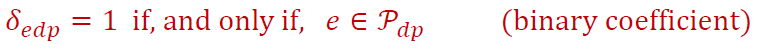
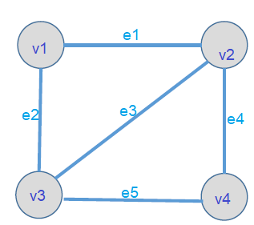
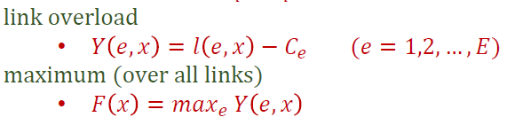
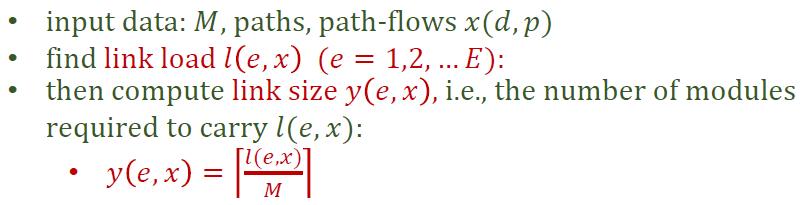
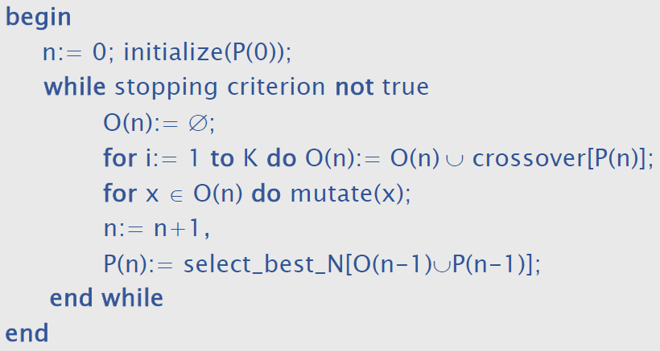

OAST cel robity na dwa bloki - zapoznanie słuchaczy z:

- modelami i metodami matematycznymi służącymi do optymalizacji i analizy sieci teleinformatycznych
- zastosowaniami programowania liniowego i całkowitoliczbowego, metaheurystyk oraz teorii kolejek do wybranych problemów związanych z projektowaniem sieci teleinformatycznych

**Blok 1 - zakres**

- sieci przepływów wielotowarowych jako model matematyczny do optymalizacji sieci teleinformatycznych
- sformułowania reprezentatywnych problemów optymalizacji sieci
- metody programowania liniowego* i programowania całkowitoliczbowego** w zastosowaniu do rozwiązywania problemów optymalizacji sieci
- metody heurystyczne
- problem wymiarowania optycznych sieci transmisyjnych w technologii DWDM (projekt)

*algorytm simpleks

**algorytm podziału i ograniczeń

# Blok 1 - Optymalizacja sieci

## Multicommodity flows  - przepływy wielotowarowe 

**Commodity** - given **volume** to be sent from its **source** node to its **destination ** node. 

**Path flow** - a mean by which **commodity** can flow

*commodity* charakteryzuje jego *volume*, *source* oraz *destination*. To jest dane. Realizacje przepływu tego towaru robią *path flows*.

- the path realizing flows for a given commodity do not have to be disjoint (rozłączne)
- the sum of all flows using a given link cannot exceed this link's capacity
- in general, different flows realizing the same commodity can use common links


> **Commodity**{
>
> src: v1
>
> dst: v2
>
> volume: 100bit/s
>
> }
>
> To **commodity** realizowane jest przez 3 **flowy**. 
>
> `Flow1` ma scieżkę `e1` i idze nią 50bit/s
>
> `Flow2` ma ścieżkę `e2->e4` i idze nią 30bit/s
>
> `Flow3` ma ścieżkę `e2->e6->e5` i idzie nią 20bit/s
>
> Jak widać  ścieżki flowów **flow paths** nie muszą być rozłączne. Krawędź e2 występuje w dwóch flow path`ach
>
> Załóżmy, że każda krawędź (link) ma capacity 60bit/s no i tu też się zgadza suma flow nie przekracza na żadnym linku jego capacity


> Teraz dodane zostało kolejne **Commodity**{
>
> src: v4
>
> dst:v6
>
> volume: 50bit/s
>
> }
>
> To commodity realizowane jest przez 2 flowy:
>
> `Flow1` ma scieżkę `e6->e8`
>
> `Flow2` ma ścieżkę `e5->e1->e3`
>
> Jak rozdzielić volume?
>
> link `e1` ma już na sobie  50bit/s, więc tam możemy posłać już tylko 10bit/s, stąd:
>
> `Flow1` idzie 40bit/s
>
> `Flow2` idzie 10bit/s
>
> 

## Basic notions

notions - notacja

### Graph


Graph has:

- **nodes** oznaczane poprzez `v`. Jest ich `V`
  - `v = 1,2,...V`
- **links** oznaczane poprzez `e`. Jest ich `E`
  - `e = 1,2,...,E`
  - jest to nieuporządkowana para node'ów 
    - zapis: `{v,w}` gdzie `v,w` to node'y

> Na rysunku mamy `V=6, E=9`
>
> Więc ten graf to:
>
> node'y: `v1, v2, v3, v4, v5, v6`
>
> links: `e1={v1,v2}, e2={v1,v3}, e3={v1,v6},....e9={v4,v5}`

### Paths

Path is described by nodes and links by which it goes.

Zapis:


`Pp` oznacza path numer `p` 

> np. `P1` to ścieżka nr `1`


Przykładowe ścieżki między `v1` a `v2`

```
P1: v1,e1,v2
P2: v1,e2,v3,e6,v4,e5,v2
P3: v1,e2,v3,e7,v5,e9,v4,e5,v2
P4: v1,e2,v3,e7,v5,e9,v4,e6,v3,e4,v2
```

Możemy wśród ścieżek wyróżnić:

**Simple path** - scieżka, która nie zawiera w sobie pętli. 

> P1, P2 i P3 są *simple*
>
> P4 jest *not simple*, bo zawiera pętlę
>
> > Ale gdyby była ścieżka `v1,e2,v3,e5,v2,e1,v1`, która sama w sobie jest pętlą (kończy się i zaczyna na tym samym node'ie) to ona jest *simple*

Ofc. links też mogą występować w ścieżce wielokrotnie (wtedy nie jest ona simple)

***

Simple path ma jedną bardzo ważną właściwość:


No bo inaczej path'y można zapisać:

```
P1: e1
P2: e2,e6,e5
P3: e2,e7,e9,e5
P4: e2,e7,e9,e6,e4
```

No a to można zapisać w wektorze, która ma zasadę:


### Links

Co charakteryzuje **link**?


`y3` lub `c3` to liczba modułów (np. garstka światłowodów) zainstalowanych na linku numer `3`

`M` określa ile jeden moduł daje capacity 

`C3` określa łączną (wszystkich modułów) capacity linka o numerze `3` 

### Demand

Wcześniej mówiliśmy **commodity**.

`d=1,2....D` 

W grafie jest ich `D`

Demand charakteryzuje para node'ów i volume


Demandy są realizowane przez **flowy**. 

Flowy mają swoje ścieżki.


`Pdp` oznacza path o numerze `p` dla demandu o numerze `d`.

Tutaj też możemy wprowadzić binarny wektor charakterystyczny.



Jeśli dana krawędzi `e` należy do ścieżki `p` zapotrzebowania `d` to dajemy w tym miejscu `1`, jeśli nie - `0`

### Przykład

**Opis grafu**



W tym grafie V=4, E=5.

Node'y i linki zawasze numerujemy od 1, więc nie ma potrzeby pisać nic więcej V=4 implikuje, że node'y to zbiór {v1,v2,v3,v4}.

O linkach możemy dopisać

```
e1={v1,v2}, e2={v1,v3}, e3={v2,v3}, e4={v2,v4}, e5={v3,v4}
```

**Opis links**


Np. c2=4, czyli pojemność e2 to 4 moduły ==> 8Mb/s.

**Opis demands**


Mamy 6 demandów. Opis ich `src` i `dst` został oddzielony od `volume`. Ale dzięki indeksowi od `h` możemy przypisać dane volume do demanda.

Np. demand o numerze `2` jest między `v1` i `v3` a jego volume to `4Mb/s`

**Scieżki realizujące demandy**

Zróbmy sobie przykład dla demanda 4.

```
Demand 4{
src: 2 node //pole src ma wartość 2 i jest typu node
dst: 3 node
volume: 2 capacity // pole volume ma wartość 2 i jest typu capacity (więc jednostka Mb/s)
}
```


Dobra wypiszmy sobie wszystkie Pathy dla wszystkich demandów:

```
P11={10000} P12={01100} P13={01011} 
P21={01000} P22={10100} P23={10011} 
P31={10010} P32={01001}				
P41={00100} P42={11000} P43={00011} 
P51={00010} P52={00101} P53={11001} 
P61={00001} P62={00110} P63={11010} 
```

To co też mamy dane to volume na każdy demand oraz capacity każdego linku

```
h1 = 3    // demand 1 ma volume 3 Mb/s
h2 = 4    // demand 2 ma volume 4 Mb/s
h3 = 5    // demand 3 ma volume 5 Mb/s
h4 = 2    // demand 4 ma volume 2 Mb/s
h5 = 3    // demand 5 ma volume 3 Mb/s
h6 = 4    // demand 6 ma volume 5 Mb/s

C1 = 4    // link 1 ma capacity 4 Mb/s
C2 = 8    // link 1 ma capacity 8 Mb/s
C3 = 6    // link 1 ma capacity 6 Mb/s
C4 = 4    // link 1 ma capacity 4 Mb/s
C5 = 12   // link 1 ma capacity 12 Mb/s
```

No i teraz trzeba w każdym demandzie odpowiednio podzielić jego volume na jego ścieżki.

Zważając przy tym, że zaalokowanie danego volume na ścieżkę zaalokuje daną capacity każdego linku wchodzącego w skład ścieżki.

Trzeba więc rodzielanie volume na pathy robić tak, aby na żadnym linku nie zaalokować więcej niż link's capacity.

I to się nazywa właśnie ---> **Demand Allocation Problem**

## DAP - Demand Allocation Problem

### Flow Allocation x

Jak już podzielimy volume danego demanda na pathy tego demanda to powstanie nam kilka **flow allocation**.

> Np. w obrębie demanda o volume 8 Mbit/s i trzech scieżkach rodzielimy, że
>
> - 1-szym pathem idzie 3 Mbit/s
>
> - 2-gim pathem idzie 4 Mbit/s
>
> - 3-cim pathem idzie 1 Mbit/s 
>
> To zrobiliśmy 3 obiekty typu **flow allocation**


Czyli **x** to powiązanie pewnej części volume demanda z konkretnym pathem tego demanda.

Właściwości x:

- ma demand do którego należy
- ma path, która należy do demanda
- ma ułamek volume demanda

> Przkład
>
> ```
> hd = 8      // mamy demand `d` o volume 8
> P1, P2, P3  // oraz ma on 3 pathy
> x(d,p) - number of demand units realized on path number `p` 
> x(d,1) = 3  // 1-szym pathem idzie 3 Mbit/s
> x(d,2) = 4  // 2-gim pathem idzie 4 Mbit/s
> x(d,3) = 1  // 3-cim pathem idzie 1 Mbit/s 
> 
> x(d,1)+x(d,2)+x(d,3) = 3 + 4 + 1 = 8 = hd
> ```

Jak już zrobimy **flow allocations** dla każdego demanda w grafie, to wtedy możemy przystąpić do obliczenia ile volume płynie przez każdy link i czy nie przekracza to jego capacity.

**Funkcja x**


```
d - numer demanda
p - numer patha tego demanda
```

`x` to funkcja, która dla danego demanda, dla danej jego ścieżki określa ile jest na tym pathie `demand units`.

### Link Load Calculation


Całkowita liczba `demand units` (ta sama jednostka co volume i capacity) jest dana wzorem.

`l` to funkcja przyjmująca jako argument

```
e - numer określający dany link
x - funkcja opisująca flow allocations (ile demand unit na danej ścieżce danego demanda)
```

- Najpierw idziemy po wszystkich demandach w grafie.

- Potem idziemy po wszystkich ścieżkach tego demanda.
- `delta edp` mówi czy dany link jest w danej ścieżce danego demanda `1 - tak, 0 - nie`.
- Jeśli jest to do funkcji `x` wysyłamy dany demand i jego path a ona zwraca nam ile jest `deamand units` i mnożymy to razy 1

Możemy to zapisać w takiej pętli.

(która liczy już dla każdego linku)


Zauważ, że `delta edp` zostało zrealizowane jako if.

### Link overload

Dobra, ja już policzmy dla każdego linku wartości funkcji `l(e,x)`, to sprawdźmy czy nie wychodzą ona więcej niż `Ce` czyli capacity danego linku.

Definiujemy w tym celu kolejną funkcje (`Y`), która przyjmuje te same argumenty co funkcja `l` oraz `Ce` i mówi o tym, czy dany link jest przeciążony czy nie.


Funkcja `Y` może przyjmować wartości

```
< 0 - wtedy link jest niedociążony ---> jest git :D
= 0 - wtedy link jest nasycony
> 0 - wtedy link jest przeciążony  ---> nałożone jest na niego więcej volume niż ma capacity :(
```

#### Przykład

Mamy taki graf a w nim następujące demandy i pathy dla tych demandów.


Dana też nam została funkcja `x(d,p)`

```
x(1,1) = 0, x(1,2) = 3, x(1,3) = 0
x(2,1) = 2, x(2,2) = 0, x(2,3) = 2
x(3,1) = 2, x(3,2) = 3   			// zauważ ze demand 3 ma tylko 3 pathy
x(4,1) = 1, x(4,2) = 0, x(4,3) = 1
x(5,1) = 1, x(5,2) = 2, x(5,3) = 0
x(6,1) = 2, x(6,2) = 2, x(6,3) = 0 // zauważ że w każdym demandzie suma x'ów daje hd
```

Jak tak popatrzymy na indeksy to w sumie macierz i jak ją odwrócimy to mamy taką nieco ładniejszą tabelkę, która pozwala nam na szybki odczyt funkcji `x(d,p)`.


**Liczenie link loads**

Proponuje zrobić drugą tabelkę "Paths"


Pierwsze dwie kolumny identyifkują path (jako demnad i numer patha w demandzie) po czym bardzo łatwo i szybko znajdować path w tabelce `x(d,p)`.

Kolejne kolumny to wektor `delta edp`, czy dany link jest w pathie. 

Wystarczy więc dla każdego linku iść od góry patrzeć, gdzie jest jeden. Potem patrzeć w lewo, żeby mieć identyfikator patha w tabelce `x(d,p)`

```
l(1,x) = 0 + 0 + 2 + 2 + 0 + 0 + 0 = 4  //link load dla linku 1 wynosi 4
l(2,x) = 3 + 0 + 2 + 3 + 0 + 0 + 0 = 8
l(3,x) = 3 + 0 + 1 + 2 + 2 = 8
l(4,x) = 0 + 2 + 2 + 1 + 1 + 2 + 0 = 8
l(5,x) = 0 + 2 + 3 + 1 + 2 + 0 + 2 = 10
```

**Liczenie link overloads**

W przykładzie mamy dane:


No to liczymy teraz Y'greki:

```
Y(1,x) = l(1,x) - C1 = 4 - 4   =  0 // link dociążony na maxa
Y(2,x) = l(2,x) - C2 = 8 - 8   =  0 // link dociążony na maxa
Y(3,x) = l(3,x) - C3 = 8 - 6   =  2 // link przeciążony
Y(4,x) = l(4,x) - C4 = 8 - 4   =  4 // link przeciążony
Y(5,x) = l(5,x) - C5 = 10 - 12 = -2 // link niedociążony
```

### Definicja problemu

Jak już mamy policzone funkcje `Y` - overloady, to zdefiniujmy sobie funkcje `F`



Która określa po prostu max wartość ze zbioru wartości funkcji `Y`.

No i cały Demand Allocation Problem polega na tym, aby w danym grafie poszukać takie *Flow allocations (x)*, żeby wartość tej funkcji F zminimalizować.


Narazie poznaliśmy definicje problemu, jak go rozwiązać jeszcze nie wiemy.

## DDAP - Dimensioning and Demand Allocation Problem

Problem wymiarowania i alokacji zapotrzebowań.

W DAP mieliśmy daną sieć (wraz z linkami) i dążyliśmy do tego aby znaleźć takie **flow allocations x(d,p)**, aby przeciążenia w sieci były jak najmniejsze. 

W DDAP dopiero tworzymy linki, jeszcze ich nie ma. Znane są node'y i demand'y. Tutaj również szukamy optymalnej x(d,p) --> tzw. **flow table** ---, ale tym razem będzie ona będzie podstawą do kupna linków. W problemie chodzi o to, aby zminimalizować koszt linków.



Czyli do momentu obliczenia *link load* zadanie jest identyczne jak w DAP. Dopiero następny krok się różni, ponieważ tu nie liczymy *link overload*. Tu funkcja **y(e,x)** to liczba modułów, które należy zainstalować dla każdego linku.


*


### Przykład


Demands and its paths:

```
Demand 1: (src,dst) = (1,2) hd = 1. P11 = {100}, P12 = {011}
Demand 2: (src,dst) = (1,3) hd = 1. P21 = {010}, P22 = {101}
Demand 3: (src,dst) = (2,3) hd = 1. P31 = {001}, P32 = {110}
```

Szukamy **flow allocations (macierzy rozpływu)**.

Skoro demandy mają volume tylko 1, oraz tylko dwie ścieżki, to sprowadza się do wyboru po prostu jednej z dwóch ścieżek dla każdego demanda.

Na logike widać, że mniejsze koszty będą wtedy, gdy po prostu położymy mniej linków. Czyli w grafie wyżej 2 zamiast 3. Dlatego ułóżmy taką macierz rozpływu, aby omijały one link nr 3.

```
x(1,1) = 1, x(1,2) = 0
x(2,1) = 1, x(2,2) = 0
x(3,1) = 0, x(3,2) = 1

// liczmy z tego l(e,x) i wychodzi
l(1,x) = 1 + 0 + 1 = 2
l(2,x) = 0 + 1 + 1 = 2
l(3,x) = 0 + 0 + 0 = 0
// czyli wyszło nam, że e1 i e2 potrzebują mieć capacity 2Mbit/s, a e3 zero
// liczymy więc y - ile modułów na dany link
y(1,x) = [2/2] = 1
y(2,x) = [2/2] = 1
y(3,x) = [0/2] = 0
// teraz liczymy funkcje F(x) czyli sumę kosztów na każdy link
F(x) = 1*1 + 1*1 + 1*0 = 2
```

To jest klasyczny przypadek, dobrze znany i prosty. Wiemy, że jest to rozwiązanie optymalne, ale jak rozwiązywać takie problemy w ogólności? Jak to wpisać do komputera, która "na logikę" nie zauważy tego co człowiek. O tym opowie następny rozdział.

## Algorithms for DDAP/DAP

W obu problemach to czego szukamy to **x(d,p)**. W zależności od tego liczymy funkcje **F(x)** i oceniamy czy to rozwiązanie (ten x(d,p)) jest optymalny czy nie. 

Pierwsze rozwiązanie jakie przychodzi do głowy to policzyć wszystkie możliwe kombinacje x(d,p) i wybrać tę gdzie F(x) jest najmiejsze, czyli **Brute Force**. Drugą pronowanym podejściem są metody heurystyczne, a dokładniej adaptacji jej ogólnego **algorytmu ewolucyjnego** do tego problemu. Ostatnie podejście to zapis problemu jako **Linear Relaxation**, które w ogólności da się rozwiązać algorytmem simplex.


- EA - Evolutionary Algorithm
  - gwarantuje jedynie rozsądne rozwiązanie w rozsądnym czasie, ale nie wiemy jak daleko jesteśmy od optimum.

- BFA - Brute Force Algorithm
  - przejrzenie całej przestrzeni rozwiązań. Gwarantuje optimum, ale duży koszt
- BBA - Branch&Bound Algorithm
  - gwarantuje optimum 

## Evolutionary Algorithm

### Heurystyka

**Heurystyka** - algorytm nie gwarantujący znalezienia rozwiązania optymalnego, ale dość dobrego w rozsądnym czasie. Używane w problemach gdzie znalezienie rozwiązania dokładnego ma zbyt dużą złożoność obliczeniową lub nie jest możliwe. Metody heurystyczne zaliczają się do AI. Pojęcie to jest bardzo szerokie. Wiele heurystyk wykorzystuje losowość.

**Metaheurystyka** - ogólny algorytm heurystyczny (opisujący samą ideę poszukiwań). Metaheurystyką jest np. algorytm zachłanny (jako ogólna idea), zaś heurystyką jest np. algorytm najbliższego sąsiada (jako zastosowanie idei algorytmu zachłannego do konkretnego problemu).

Przykładowe techniki konstruowania algorytmów heurystycznych to:

- przeszukiwanie lokalne,
- algorytmy zachłanne,
- symulowane wyżarzanie,
- przeszukiwanie tabu,
- algorytmy genetyczne.

### Evolutionary Algorithm


**Chromosom** - indywidualne rozwiązanie

**Populacja** - zbiór N *chromosomów*, w jednej iteracji mamy wiele *chromosomów*, którzy kandydują jako optimum

**Generacja** - generacja określa iteracje w algorytmie, kolejne *generacje* to następujące po sobie *populacje*. *Populacja*, może naprzykład liczyć 100 *chromosomów*, na podstawie których powstaje potem *populacja* w nowej *generacji*.

**Funckja dopasowania** - Funckja oceniająca jak bardzo pojedynczy chromosom jest wartościowy jako rozwiązanie. Sposób ewaluacji chromosomu.

**Geny** - reprezentują wewnętrzną strukturę *chromosomu*. Są po to, żeby dało sie mutować/krzyżować *chromosomy*.

Jak działa EA?

- Mamy generacje zerową (np. stworzoną losowo) składającą się z N chromosomów
- Następnie mutujemy i krzyżujemy chromosomy 
- wybieramy najlepiej dopasowane chromosomy i tworzymy następną generację
- Powtarzamy, aż w końcu w pewnej generacji wybierzemy z populacji najlepszy chromosom jako optimum

Jak dokonujemy krzyżowania i mutowania? Za pomocą **operatorów genetycznych**


**Crossover vs Mutation**

Crossover to stworzenie pomieszanie genów (nie ruszamy samych genów). Mutation to zmienienie nieco genów.

Jak to działa dokładnie?



Rozpoczynamy od zainicjowania licznika iteracji oraz populacji zerowej.

N - liczba chromosomów w populacji

K - liczba chromosomów jaką tworzymy z krzyżówki

Następnie w każdej iteracji:

- tworzymy pusty zbiór chromosomów `O`
- następnie zapełniamy zbiór `O` tworząc chromosomy z krzyżówki*  tych które są w `P`
- następnie zbiór `O` poddajemy mutacji**
- na sam koniec spośród zbiorów `O` i '`P` wybieramy N najelepszych chromosomów i tym tworzymy nowy zbiór `P`

*(czyli iterujemy po chromosomach i te, które mają lepszy fitness, prędzej zostaną rodzicem)

**(czyli iterujemy po chromosomach i każdy ma jakieś p-stwo że zmutuje)

### Evolutionary Algorithm for DDAP

Wyszczególnienie metaherystyki o nazwie Evolutionary Algorithm na konkretny problem polega na:

- zdefiniowaniu czym jest chromosom oraz gen
- na tej podstawie zdefiniowaniu jak ma wyglądać mutacja oraz krzyżowanie


**Chromosom w DAP**

W DDAP/DAP chromosem jest jedno *flow allocation x (macierz przepływu)*, no bo to tego optymalnego szukamy.

**Gen w DAP**

Genami są alokacje volume na poszczególne ścieżki w obrębie jednego przepływu.

**Crossover**


**Mutation**


#### Kwestie do rozstrzygnięcia 


