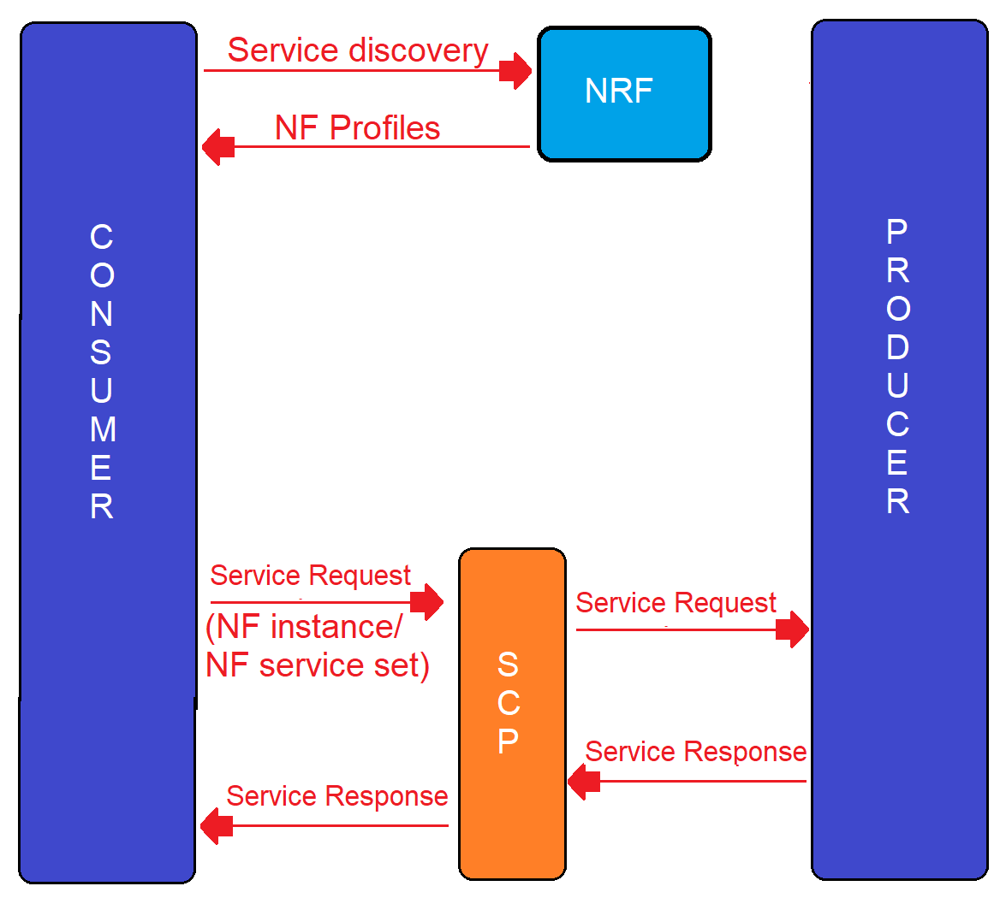

# 5G Service-Based Architecture

## Key concepts

SBA is a proven method to implement modularity in software applications. 

SBA is approach followed in 5G to develop **Network Functions  (NF)** 

The 5G core network software is broken down into various communicating services.

### Definitions

**NF service** - a capability, that is exposed by an *NF* through a **service-based interface**. An NF service may support one or more **NF service operation**.

**Service-Based Interface (SBI)** - represents how the set of *NF Services* is provided or exposed by a given **NF**. This is the interface where the *NF service operations* are invoked (Namf, Nsmf, Nudm, Nnrf, Nssf, Nausf, Nnef, Nsmsf, etc.)

### Summary

**S**ervice **B**ase **A**rchitecture is a system architecture in which system functionality is achieved by *Network Functions* providing services to authorized *Network Functions* that consume their services.

## Communication models in 5G

3GPP (3rd Generation Partnership Project*) has chosen REST (**RE**presentational **S**tate **T**ransfer**) architectural design model to support design and communication between the distributed applications that comprise the 5G *Network Functions*.

> ***3rd Generation Partnership Project** (**3GPP**) ) is an umbrella term for a number of [standards organizations](https://en.wikipedia.org/wiki/Standards_organization) which develop protocols for [mobile telecommunications](https://en.wikipedia.org/wiki/Mobile_telecommunications). 
>
> Its best known work is the development and maintenance of:[[1\]](https://en.wikipedia.org/wiki/3GPP#cite_note-1)
>
> - [GSM](https://en.wikipedia.org/wiki/GSM) and related [2G](https://en.wikipedia.org/wiki/2G) and [2.5G](https://en.wikipedia.org/wiki/2.5G) standards, including [GPRS](https://en.wikipedia.org/wiki/General_Packet_Radio_Service) and [EDGE](https://en.wikipedia.org/wiki/Enhanced_Data_Rates_for_GSM_Evolution)
> - [UMTS](https://en.wikipedia.org/wiki/Universal_Mobile_Telecommunications_System) and related [3G](https://en.wikipedia.org/wiki/3G) standards, including [HSPA](https://en.wikipedia.org/wiki/High_Speed_Packet_Access) and [HSPA+](https://en.wikipedia.org/wiki/Evolved_High_Speed_Packet_Access)
> - [LTE](https://en.wikipedia.org/wiki/LTE_(telecommunication)) and related [4G](https://en.wikipedia.org/wiki/4G) standards, including [LTE Advanced](https://en.wikipedia.org/wiki/LTE_Advanced) and [LTE Advanced Pro](https://en.wikipedia.org/wiki/LTE_Advanced_Pro)
> - [5G NR](https://en.wikipedia.org/wiki/5G_NR) and related [5G](https://en.wikipedia.org/wiki/5G) standards, including [5G-Advanced](https://en.wikipedia.org/wiki/5G-Advanced)
> - An evolved [IP Multimedia Subsystem](https://en.wikipedia.org/wiki/IP_Multimedia_Subsystem) (IMS) developed in an access independent manner

> **REpresentational State Transfer (REST) is a software architecture style led out from experiences from writing a specification of HTTP for distributed systems (pl. Systemy rozproszone). It uses homogeneous interface, stateless communication, resources, representations, hypermedia and HATEOAS.

Figure 1-28 shows a simple case when the consumer was aware of the contact details of the producer and was able to contact the producer that provided the service. However if the consumer is not aware of the contact details of the producer, it needs to undergo a process of **service discovery**.

> In 5G there is a special *NF* for *service discovery* which is NRF - Network Repository Function.

### Models

There are 4 communication models in 5G.

#### Case A

Consumer has information to contact the producer.

#### Case B

Consumer is not aware of the producer details, hence it undergoes a *service discovery* process via NRF and obtains information to contact the producer.

#### Case C

Consumer via *service discovery* process receives an `NF producer set` instead of ONE producer. Consumer then contact the **Service Communication Proxy (SCP)** and provides the NF set obtained from NRF. Now SCP has the logic to select the appropriate producer from the set. SCP has load balancing logic and is aware of which is the most appropriate producer to serve this specific consumer, on this specific task, on this specific time. 

#### Case D

Consumer contact the SCP directly with with the *service request*. Then SCP contact the NRF to discover appropriate producer. Same as case C, but here the *service discovery process* is also delegated to SCP.

### Service Communication Proxy

SCP has the following funcitons:

- delegated *service discovery*
- provide load balancing
- provide secure communication between the NFs
- message forwarding and routing to a next hop SCP
- forwarding message and routing to destination Network Function

## Security Edge Protection Proxy

You know a little about communication within a single 5G core network. 

But how does networks from two different operators connect? The other way to ask this question is "how is 5G roaming done"?

We will describe it only from architecture point of view.

**Security Edge Protection Proxy** - provides a secure interconnect between 5G networks. 

According to TS 33.501 and TS 29.573 SEPP provides:

- A separate security negotiation interface **N32-c** and an end-to-end encrypted application interface **N32-f** between the two SEPPs.

- Encapsulation of HTTP/2 core signaling messages using JOSE protection for N32-f 

- Operator control of security per roaming partner (via key library)

- Trusted intermediary IPX nodes to read and possibly modify specific Information Elements of HTTP message, while completely protecting all sensitive data end-to-end. 

  > IPX - Interchange Packet Exchange is a network layer protocol and provides conectionless diagram services for Ethernet, token ring and other common L2 protocols / datalink layer protocols

- Topology hiding. It is another important aspect of SEPP. The network topology, adressing scheme, and so forth of the two networks are completely abstracted from each other.

SEPP just protects connection between service consumer and service producer from two different networks.

SEPP does not apply any authorization, becasue it is done by service producers. Auth in SEPP would be an unnecessary duplication.

SEPP just applies secure connection to every control plane message involved in **inter-PLMN** signalling. It acts as a **service relay** between the actual service consumer and the actual service producer. For both service producer and service consumer the result of *service relaying* is equivalent to a direct service interaction.

## REST and HTTP2 Methods

