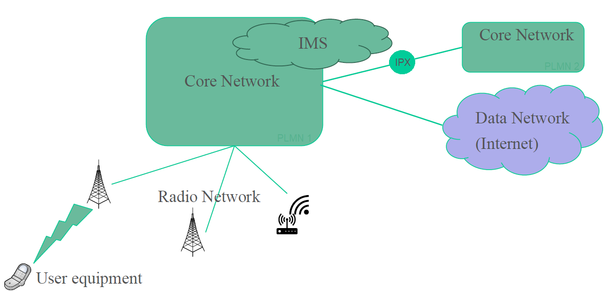

# TESM 3 

## 18

Mordziaty mówi o NSA i SA

Wszyscy są option 3, a POLKOMTEL option 4

Coś tam polkomtel nie wiem czy ma 5g na 2100  czy coś takiego ogarnąć chyba trzeba te pasma

Jak eNodeB umie gadać z 5GC, to nazywamy go **NG eNodeB** - w Polsce już prawie wszystkie stacje bazowe 4G mają te upgrade.

option 4 vs option 7 różnica jest tylko kto pełni rolę **master node**

option 7 to Pan mówi, że nie bardzo to istnieje

chodzi o dual connectivity, że telefon umie podłączyć się do dwóch stacji jednocześnie

## 19

3GPP jest bardzo techniczne, dokladne w chuj, więc normalnie tam kto pracuje to są od vendorów, Ci co tworzą te urządzenia i wiedzą jak to działa - Huawei, Nokia, Ericsson, ZTE

W telco jest mocna współpraca z państwami, no żeby było compatibility na całym świecie

Europejskie standardy robi ETSI

GSMA pracują tam nie tylko vendorzy, ale też operatorzy i bardziej zajmuje się tym jakie kroki trzeba robić, żeby zarządzać siecią - to co bardziej interesuje operatorów

Open-RAN - "poza 4G,5G moglibyśmy robić coś więcej", żeby mali vendorzy też mogli robić urządzenia 5G

OpenRAN standaryzuje interfejsy, bo do tej pory jak się kupywalo sprzet to jednego vendora

Za OpenRAN stoi mocno USA, bo oni nie mają swojego vendora w wielkiej piątce, która tworzyła 5G na cały świat

## 20

Release jak się kończy 

na koniec 2023 będzie R-18 czyli 5G advanced

6G dopiero od R-19, ale nauka już pracuje nad 6G

naukowo - pracujemy nad 6G

standardy - pracujemy nad 5G-Advanced

private networks jest dużo kasy w tym

## Ćwiczenia

Telefon budzi się trybie samolotym Polski fon, ale wylądował we Francji

- Antena wysyła informację (broadcast - jeśli ktoś chce do mnie wysyłać a ja go nie znam, to wysyłajcie mi tutaj (f,timeslots))
- Telefon kieruje się tam
- Antena odpowiada dedykowanym kanałem logicznym do synchronizacji
- Telefon wysyła info, że chce się połączyć z core'm swojego operatora 
- gNodeB robi UE interfejs N1 do swojego AMF'a, a v-AMF kieruje do h-AMF (SEPP'em wychodzi i idzie przez IPX) 
- h-AMF dostaje wiadomość (UE zamieszcza SUCI tam), h-AMF przeszukuje UDM dla tego UE
- przygotowuje wiadomość RES zaszyfrowaną kluczem publicznym i wysyłamy userowi
- user rozszfyruje ją kluczem prywatnym
- i jak sieć sprawdzi, że to jest coś co się spodziewał to git
- sieć też wysyła klucz do szyfrowania połączenia na czas tej rejestracji

- dostarczenie kluczy do v-network (v-AMF)
- koniec procedury rejestracji
- v-AMF powiadamia v-RAN odnośnie tego usera daje klucze na te rejestracje i jazdynia

hierarchia kluczów (idzie tylko w dół, z klucza wyższego rangą da się policzyć klucz niższy, ale nie na odwrót)

- Subscriber Key (**K**) - UICC i UDM ma. najbardziej chroniony fest, niestandardowy odczyt niszczy ten klucz

Uwierzytelnieni jest na klucz asymetrycznie

Szyfrowanie wiadomości na jest symetrycznie

AMF i RAN jest tunel TLS (IPsec)

Lawful Interception najczęściej używa Policja, żeby podsłuchiwać rozmowy.

Dopóki UE gada N1 z AMF to to jest NAS, a jak się zwróci do RAN do Access Stratum.

po tym jest ustawienie połączenia RRC między UE i gNodeB (na wypadek pagingu)

jak jest handover to na N1 (NAS) nic się nie dzieje, to wszystko na N2 jest, UE się przełączył, a RAN potem informuje tylko core gdzie

cały czas nie ma sesji w UPF, to wszystko się dzieje w Access Stratum.

Kolos1

1. Jak działa HARQ
2. Omówić standalone oraz non-standalone
3. Do czego służy radio bearer? jakie ma funkcje?

Coś takiego ale na materiał jaki mieliśmy w te kolosy.
