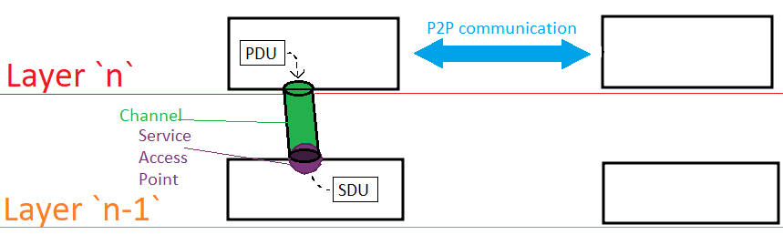

# 5G Recall

## Overview


Architektura jest jaka jest i co tu dużo mówić. Warto jedynie zauważyć, że można podłączyć się do Core za pomocą Wi-Fi, czyli używać swojego modemu w domu jako stacji bazowej. 

> Są też pomysły, żeby modemy Wi-Fi osób prywatnych były używane przez przechodniów znajdujących się w pobliżu dla zwiększenia pokrycia. Podobno PLUS kupił w tym celu UPC (dostawca Internetu domowego).

## Spectrum

**Pasmo licencjonowane** - to za którego używanie się płaci, a za używanie bez licencji płaci kary. Jak już się zapłaci to można w nim emitować z dużą mocą. Na licencjonowanym jest TV, Radio, Mobile.

**Pasmo nielicencjonowane** - to za którego używanie się nie płaci, ale można w nim emitować tylko z małą mocą. Przykład: Bluetooth, Wi-Fi, IoT.

**Technology neutral spectrum licences** - licencja, która nie wymusza używana pasma tylko w konkretnej technologii. Kiedy operator kupi dane pasmo, może go używa jak chce. These licences allow existing bands (which are used for old technologies) to be easily refarmed for 5G.

5G ma zapewnić widespread coverage oraz 5G use cases (eMBB, uRLLC, mMTC). W tym celu zdefiniowano **3 key frequency ranges**:

- Sub-1 GHz
- 1-6 GHz
- above 6GHz

Pasmo licencjonowane powinno grać pierwsze skrzypce, a nielicencjonowane can play a complementary role.

### Sub-1 GHz

600-850MHz

Slower speeds (50-250Mb/s) compared to the mid and high band, but provides a superior range.

Long-distance transmissions and rural areas lacking infrastructure will benefit from Sub-1 GHz 5G access

> 800MHz będzie so nadawania poza miastem (duży zasięg trzeba) w Polsce się nie da na 700MHz bo interfercja z Rosyjskim i Białoruskim wojskiem

### 1-6 GHz

2.1-4.2GHz

Balance both speed (100-900Mb/s) and distance, making it suitable for towns, small cities, and suburban areas.

Will be the most popular across enterprises due to its flexibility and availability* for private spectrum use.

> *Czyli skrawek tego pasma może zostać nielicencjonowany.
>
> 3.4 - 3.8 GHz C-band 
> będzie aukcja 5 bloków po 80MHz
> Pokrycie miejskie
>
> 2.1 GHz Polkomtel ma na tym 5G, reszta nie ma 5G

### above 6 GHz

24-39GHz (mmWave)

Speeds  are the fastest (up to 3Gb/s. The trade-off is that the range is limited—about 500m from the small cell tower. Brak penetracji przez obiekty.

### LTE vs 5G

5G shares frequency space with LTE. It can be used to allocate bands for both LTE-and 5G-use dynamically. Network operators can use FDD and TDD to share frequencies between the two technologies without causing interference.

> EMF - pole EM jest niejonizujące powyżej 10MHz, słońce to te same f co 5G i słońce kurwa jest potężne
> Promieniowanie nie wiemy jak długofalowo stałe działa na człowieka ale z drugiej strony to ludzie żyją coraz dłużej a telco już jest od dawna. Ofc też te fy nagrzewają np. tel jak pogadamy dłużej to telefon jest cieplutki co nie
> Ludzie głupi uciekają od anteny a to od telefonu trzeba się chronić bo on promieniuje blisko. Telefon też im dalej jest od anteny to tym z większą mocą promieniuje więc więcej anten to dla zdrowia lepiej.

## Scenarios


### mMTC

- wąskie pasmo
- ogromna ilość urządzeń IoT
- requirements for energy savings
- high requirements of computing resources (long-time connections)

Czyli po prostu IoT a na nim postawione smart cities.

## 5GS Architecture


Warto zauważyć:

- Rozdzielenie Core Network vs Radio Access Network
- Rozdzieleine control i user plane zgodnie z CUPS

Że fizycznie to wygląda tak:

- DU + CU + transport + local site + transport + regional site + transport + national site, ale o co tu chodzi mu to ja nie wiem 

local site: UPF

regional site: AMF SMF

national site: reszta

## RAN Innovations

**MIMO** - Multiple Inputs Multiple Outputs - metoda, dzięki której zwiększa się capacity łącza radiowego. Jak? Używa się wiele anten nadawczych i odbiorczych, aby jak najlepiej wykorzystać zjawisko **multipath propagation**.

**multipath propagation** - zjawisko, że sygnał radiowy dochodzi do anteny odbiorczej wieloma drogami (bo się odbija itp.)

Obecnie MIMO nazywa się konkretną technikę, warto zaznaczyć, że to jednak OFDM użyta do kodowania kanałów fizycznych jest odpowiedzialna za większy data capacity. MIMO to co innego niż beaforming i sptiala diversity. 5G używa OFDM tak jak 4G.

Proszę sobie [to przeczytać](https://www.avnet.com/wps/portal/abacus/solutions/markets/communications/5g-solutions/understanding-massive-mimo-technology/).

Technological Innovations in 5G New Radio:

- **Massive MIMO (with beamforming)** - wydajność pasma wzrost od 2 do 5x
- Multi-Technology include 10GHz+ - radio wspiera wiele use case'ów (stąd 3 pasma) w tym jedno o naprawdę potężnych bitrates
- **New multi-carrier radio transmission**: Filter-Bank Multi-Carrier, Universal Filtered Multi-Carrier, Generalized Frequency-Division Multiplexing, FBMC, UFMC, GFDM - nowe techniki w transmisji multi carrier (wiele fal nośnych), gdzie usprawniono synchronizacje i jest jej mniej a co za tym idzie poprawiono latency w uplink
- Non-Orthogonal Multiple Access and Sparse Coded Multiple Access (NOMA and SCMA) - te techniki wprowadzono aby avoid extensive signaling, a co za tym idzie mamy lower delay w URLLC.  NOMA complements OMA, ma większa interferencje, ale jest ona redukowana dzięki beamformingowi (power differences). NOMA jednak jeszcze nia ma w 5G, będzie w 6G.
- **Shared Spectrum Access** - dostęp do pasma współdzielony i z priorytetami przez kilka grup
  - primary - np. rząd policja jak jest powódź wtedy one dostają większe pasmo
  - secondary - licencjonowane pasmo dla operatorów
  - tertiary (trzeciorzędne) - nielicenjonowane pasmo - dla private campus networks
- **Advanced Inter-Node coordination thanks to cloud RAN**. CU jest w cloudzie więc może fajnie zarządzać DU, ktore jest przy gNodeB'ach, a co za tym idzie jeden user (CU go widzi) może być obsługiwany przez kilka gNodeB --> much higher bandwidth, gdy UE ma kiepskie zasieg z jednej.
- Simultaneous Transmission Reception in low-power transmission (small cells)
- **Device to Device communication** - it is network controlled especially for licensed bandwidth
- **Flexbile Networks** - thanks to NFV and SDN -> flexibility and reduction of time-to-deployment, to daje też nowe use-case'y biznesowe - warto się zakręcić wokół sieci komórkowych
- **Backhaul/Fronthaul and integration of backhaul/radio access** - fronthaul (UE-Antena), Backhaul (Antena-Core) //TODO
- **Flexible duplex** - jak operator ma w danym cell zwykłe warunki ruchu klienckiego to używa FDD, a jak nagle się zrobi dużo pasma dostępne (bo mało ludzi) to może się przełączyć na TDD (sloty czasowe zrekompensują (w sensie na minus) szersze pasmo).

> Flexible duplex.  FDD - wysyłam i odbieram na różnych częstotliwościach, TDD - odstępy czasowe time sloty na uplink i downlink, TDD jest lepiej kiedy mamy duży throughput Technologicznie możliwe, prawnie nie bo UKE decyduje jaka jest duplex na daną `f` mimo, że antena potrafi sobie zmieniać.
>
> > (UKE patrzy po prostu ile vendorów na danej f ma co --> antymonopol np. Nokie nie ma FDD na jakiejśtam)

## CN Innovations

Z racji wirtualizacji:

- On-demand deployment of service anchors
- Flexbile orchestration of Network Functions
- Shorter period of service deployment

Z racji nie wiem czego:

- Complex networks incorporating multiple services, standards and site types
- Coordination of multi-connectivity technologies

> VM vs kontener w 5G --> wygrywają kontenery

## Deployment scenarios


Jak eNodeB umie gadać z 5GC, to nazywamy go **NG eNodeB** - w Polsce już prawie wszystkie stacje bazowe 4G mają te upgrade.

Dual Connectivity - to że telefon umie podłączyć się do dwóch stacji jednocześnie w NSA trzeba z tego korzystać.


Option 1 to czysta sieć 4G.

Option 2 to czysta sieć 5G, nasz cel.

Option 3 to stan obecny wdrożenia 5G.

Option 4,5,7 "we won't see them anytime soon... or at all"

## Standarisation


Generalnie jeśli chodzi o sieci mobline to jest mocna współpraca z państwami ponieważ chcemy, aby były one kompatybilne na całym świecie. W Europie oraz europejskiego interesu w tym wszystkim standardów pilnuje ETSI.

**3GPP** - zrzesza głównie ludzi na codzień pracujących w firmach vendorów. Ci najbliżej sprzętu protokołów. Dlatego ich specyfikacje są bardzo dokładne i techniczne do bólu.

**GSMA** - zrzesza nie tylko vendorów, ale też i operatorów. Bardziej zamiast opisać jak coś dokładnie działa skupiają się na krokach jakie należy podjąć, aby zarządzać siecią mobilną.

**ITU** - brak info

**Open RAN policy coalition**

Hasło przewodnie: "poza 4G,5G moglibyśmy robić coś więcej, żeby mali vendorzy też mogli robić urządzenia 5G"

OpenRAN standaryzuje interfejsy, bo do tej pory jak się kupywalo sprzet to jednego vendora

Za OpenRAN stoi mocno USA, bo oni nie mają swojego vendora w wielkiej piątce, która tworzyła 5G na cały świat


## 20

Release jak się kończy 

na koniec 2023 będzie R-18 czyli 5G advanced

6G dopiero od R-19, ale nauka już pracuje nad 6G

naukowo - pracujemy nad 6G

standardy - pracujemy nad 5G-Advanced


private networks jest dużo kasy w tym

## Ćwiczenia

Telefon budzi się trybie samolotym Polski fon, ale wylądował we Francji

- Antena wysyła informację (broadcast - jeśli ktoś chce do mnie wysyłać a ja go nie znam, to wysyłajcie mi tutaj (f,timeslots))
- Telefon kieruje się tam
- Antena odpowiada dedykowanym kanałem logicznym do synchronizacji
- Telefon wysyła info, że chce się połączyć z core'm swojego operatora 
- gNodeB robi UE interfejs N1 do swojego AMF'a, a v-AMF kieruje do h-AMF (SEPP'em wychodzi i idzie przez IPX) 
- h-AMF dostaje wiadomość (UE zamieszcza SUCI tam), h-AMF przeszukuje UDM dla tego UE
- przygotowuje wiadomość RES zaszyfrowaną kluczem publicznym i wysyłamy userowi
- user rozszfyruje ją kluczem prywatnym
- i jak sieć sprawdzi, że to jest coś co się spodziewał to git
- sieć też wysyła klucz do szyfrowania połączenia na czas tej rejestracji

- dostarczenie kluczy do v-network (v-AMF)
- koniec procedury rejestracji
- v-AMF powiadamia v-RAN odnośnie tego usera daje klucze na te rejestracje i jazdynia

hierarchia kluczów (idzie tylko w dół, z klucza wyższego rangą da się policzyć klucz niższy, ale nie na odwrót)

- Subscriber Key (**K**) - UICC i UDM ma. najbardziej chroniony fest, niestandardowy odczyt niszczy ten klucz

Uwierzytelnieni jest na klucz asymetrycznie

Szyfrowanie wiadomości na jest symetrycznie

AMF i RAN jest tunel TLS (IPsec)

Lawful Interception najczęściej używa Policja, żeby podsłuchiwać rozmowy.

Dopóki UE gada N1 z AMF to to jest NAS, a jak się zwróci do RAN do Access Stratum.

po tym jest ustawienie połączenia RRC między UE i gNodeB (na wypadek pagingu)

jak jest handover to na N1 (NAS) nic się nie dzieje, to wszystko na N2 jest, UE się przełączył, a RAN potem informuje tylko core gdzie

cały czas nie ma sesji w UPF, to wszystko się dzieje w Access Stratum.

Kolos1

1. Jak działa HARQ
2. Omówić standalone oraz non-standalone
3. Do czego służy radio bearer? jakie ma funkcje?

Coś takiego ale na materiał jaki mieliśmy w te kolosy.


Na air interface nie musi być szyfrowania w User Plane, i nikt w polsce w LTE nie szyfruje i to jest największa dziura bezpieczeństwa w sieciach moblinych.

# Kolos

Był kolos

# Air Interface

## Intro

Dzisiaj popatrzymy na Air Interface.

Jest to komunikacja między UE a gNodeB.

Należy tu rozróżnić komunikację dwóch typów UE może gadać z gNodeB albo w ramach:

- NAS - Non-Access Stratum. Żeby gadać z core network (gNodeB zapewnia wtedy transparentny interfejs N1). UE <--> AMF
- AS - Access Stratum - Żeby gadać z RAN'em (interfejs N2). UE <--> gNodeB

## Protocol Stack

Jak wygląda protocol stack w 5G?


My dzisiaj zajmujemy się Access Stratum między UE a gNodeB:


Skoro widać te wartswy oraz na nich działające protokoły to zdefiniujmy sobie kilka rzeczy.

**Peer to peer communication** - apka na UE działająca w warstwie `n` "gada" z apką w gNodeB działającą w warstwie `n`. Z innymi warstwami nie gadają. To w jakim języku one gadają to określa *protokół danej warstwy*

**Channel, Service Access Point** - apka warstwy `n`, żeby wysłać coś do apki warstwy `n` po drugiej stronie musi swoją wiadomość wsadzić do apki warstwy niższej. Robi to za pomocą *service access point*, wystawiony przez tę warstwę wkładając swoją wiadomość w odpowiedni *channel*, który między tymi warstwami istnieje. 

**Protocol Data Unit** - Jak apka warstwy `n` coś wytworzy do wysłania, to nazywamy to *Procotocl Data Unit*. 

**Service Data Unit** - Jak apka warstwy `n` wyśle swoje PDU przez channel wyśle do apki warstwy `n-1` to wartwa `n-1` dostanie PDU warstwy wyższej i zrobi swoje (ale to już się nazywa SDU), bo ona wykonała usługę jakąś na tym PDU.

### Peer to Peer communication: protocol layer



### Control Plane

#### RRC

**Radio Resource Control** - protocol used in 5G on the Air Interface between UE and gNodeB. Specified in TS 38.331. RRC messages are trasnported via PDCP-messages. The major functions include:

- connection Establishment and connection Release (connection na kanale logicznym timeslotowym)
- broadcast of system information
  - np. info synchronizacyjne (ustalanie jak wysylac i co wysylac w jakich slotach czasowych)
  - czy jest standalone czy non-standalone (czy dwa interfejsy radiowe czy nie (dual connectivity)), czy bedziemy używac carrier aggregation
  - czy bedzie szyfrowanie i jakie
- paging notification
  - wysyłanie na broadcastowy kanał, "ktoś chce sesje z tą komórką" i UE się odzywa "to ja"
- radio bearer establishment, reconfiguration and release (dedykowany bearer dla UE na coś tam)
  -  (service radio bearer SDR i Data radio bearer) (ale to core daje info o QoS Flow w SDAP jakie ma być)
- RRC connection mobility procedures
  - zleca robienia pomiarów UE (do handoveru i do lokalizowania UE), zeby wiedziec jaką moc trzeba nadawać (jak UE blizej stacji to mozna zmniejszyc moc)
  - handover and interRAT handover 
  - wie gdzie forwardować NAS

> RRC to serwis point, który kontroluje wszystko co sie dzieje w antenie, jest to punkt kontaktowy z corem, core wysyła na niego komendy jak co robić.
>
> By means of the signalling functions the RRC configures the user and control planes according to the network status and allows for Radio Resource Management strategies to be implemented

The operation of the RRC is guided by a state machine which defines certain specific states that a UE may be present in.  The different states in this state machine have different amounts of radio resources associated with them and these are the resources that the UE may use when it is present in a given specific state.

Stany RRC w jakich może być UE z danym gNodeB:

- `RRC_Idle`- nie ma ustalone jeszcze połączenia RRC (apki RRC nie znają się nawzajem)
  - wszystkie decyzje są po stronie UE
  - RRC idle w antenie ma tylko przekazać coś do core i wtedy core moze zrobić stan RRC_Connected
  - antena w idle robi paging
- `RRC_Connected`
  - jest sesja danych, RRC kontroluje wszystko co sie dzieje z UE, wszystkie decyzje są po jego stronie
- `RRC_Inactive`
  - jeszce nie ma sesji danych, 

### User Plane

#### SDAP

**Service Data Adaptation Protocol** - introduced in 5G. Maps **Qos Flow IDs** to **Radio Bearers**. The SDAP layer is configured by the RRC.

Jak UE rozpocznie *PDU session*, to SMF wymyśli dla niej *Qos Flow ID*, które w 5G jest najmniejszą jednostką, która w core decyduje o jakoście przekazu danych. 

> W LTE core zlecał RAN'owi bezpośredno jaki ma zrobić bearer (tym się zajmował protokół PDCP, który w 5G jest nieco copy&paste z 4G). Jedyna więc funkcja SDAP, to mapowanie QoS Flow, które umie core, na Radio Bearer, które umie PDCP. 

Do warstwy SDAP każdy pakiet przychodzi z QoS Flow ID i wszystkie które przyjdą z takim samym beda potraktowane tak samo.

SDAP podejmuje na podstawie QoS Flow ID decyzję:

-  jakiego typu tworzyć Bearer'y:
  - Guaranteed BitRate (GBR)
  - Non-Guaranteed BitRate (Non-GBR)
  - GBR with latency

- Jak ma być transfer w Uplink:
  - negotiated QoS, czy
  - reflective QoS (po 50%)
- Który typ Radio Bearer zrobić:
  - Signalling Radio Bearer:
    - SRB0 - Common RRC Signalling: (`rrc connection request`, `rrc connection setup`, `rrc connection re-establishment request`). Since this radio bearer is used for all the user that's why it is not security and integrity protected.
    - SRB1 - UE dedicated RRC signalling (`rrc connection setup complete`, `rrc connection re-establishment complete`, `rrc connection re-configuration complete`). Once the AS security is activated, all the signalling messages over this bearer will be security and integrity protected.
    - SRB2 - UE dedicated NAS messages such as ` dedicated bearer creation message`
  - Data Radio Bearer:
    - DRB - is established for the transmission of data plane packets. Multiple DRBs can be established for an UE due to different types of services used by UE such as internet browsing, voip call etc. 

Na jedną *PDU session* tworzone jest jedno *SDAP entity*. Czym można je skonfigurować?

- QoS Flow Identifier (QFI)
- Allocation and Retention Priority (ARP)
- Reflective QoS attribute
- Guaranteed Flow Rate + max Flow Rate, Max packet loss
  - to podobne do Token Bucket , i te parametry defniuja ten wiadro
- Notification control from RAN
  - niech medium informuje ze jest np. dużo błędów albo zbyt dużo pakietów w wiadrze i żeby zwolnić tempo, więc tam wyżej SDAP musi wyrzucić jakąś sesję i wtedy SDAP mówi do SMF "niestety, trzeba tę sesję wyrzucić".

> PDCP istnieje w LTE, SDAP nie. Więc funkcjonalność PDCP  jest copy&paste z poprzedniego standardu, więc tam jest bardzo duzo. SDAP robi malutko.

> W 4G nie było, a w 5G jest nacisk na QoS. 4G mniej więcej cały ruch był ten samo - multimedia. Różnica był tylko między voice i multimedia (voice+video), ale to tak naprawdę załatwisz jedną kolejką. Jest niby 9 klas, ale jest 3 używane na głos i 1 na mutlimedia.
>
> Ale w 5G jest sieć która ma tworzyć dużo nowych modeli biznesowych i URLLC, MBB, MMTC, i wgl to już klasi jest mega dużo fest że hej. i Właśnie dlatego się pojawia SDAP

### Plane-independent

#### PDCP

**Packet Data Convergence Protocol** - protocol located on top of the air interface. Provides transport services for RRC (CP) and SDAP (UP) upper layers. Specified in TS 38.323. Functionalities:

- transfer of control/user plane data
  - SDAP wybiera jakość jaka ma być, jest odpowiedzialny za wysoko-poziomowy (najwyżej) transport
- TCP/IP header compression
  - antena ma max 100 userów, więc nie ma sensu wysyłać całego nagłówka TCP/IP. Kompresujemy tylko nagłówki TCP/IP, HTTP (lub inny protokół apki) to dla nas dane więc "nie znamy tego" jako PDCP.
- Sequence numbering;
  - przydant np. w handover
- ciphering;
- integrity protection.
  -  jeśli Oscar zmieni choćby 1 bit w tych danych -> będziemy wiedzieli.
- reply protection
  - do szyfrowania pakietów używany jest nie tylko `kenc` ale też i `seqNum` 
  -  dajemy jeszcze sequence number, i dzieki temu kazdy pakiet jest szyfrowany innym kluczem, zeby nikt inny (kto nie wie jaki jest seq. num. ) nie bedzie wstanianie wysyłać mi ten pakiet, nawet jesli wie ten KLUCZ (**K**)

- PDCP PDU discards TODO????

- PDCP PDU routing in dual connectivity: split/non split (1,2 or 4 RLC entities per PDCP TODO????

  - Dual Connectivity - połączenie UE do dwóch anten na raz.

    Jeśli mamy Dual Connectity ON to robimy splitDRB

    Jeśli potrzebujemy Uplink i Downlink sesje, która to potrzebuje, to będzie mieli 4 RLC per każdy PDCP.

- PCDP PDU for lower latency (SRB0)

- Selection of AM, UM ,TM 

  - Ack Mode - jak w TCP
  - UnAck Mode - jak w UDP
  - Transparent Mode - jak //TODO
  - Czyli czy każemy, żeby RLC potwierdzało każdy RLC message czy nie.


#### RLC

> PDCP decyduje jaki jest sposób przekazu a RLC wykonuje ten sposób
>
> RCL przygotowuje dane do MAC'a

**Radio Link Control**

Functionalities:

- Transfer of upper layer PDUs in one of 3 modes:
  - AM - Ack Mode (ARQ)
  - UM UnAck
  - TM - Transparent
- Reaseembly window for segmentation
  - MAC wysyła dane w chunkach (bo to ostatnia warstwa przed zamianą na sygnał ele), więc to co trzeba mu dać to takie chunki. RLC właśnie musi zrobić te chunki. Chunki mają określony rozmiar np 64. Co jeśli dostaniemy od PDCP dwa pakiety po 20? Trochę głupi je wysyłać w oddzielnych MAC PDU (chunki), bo tracimy ok 70% przestrzeni, więc RLC składa oba te PDCP PDU w jeden pakiet i przekazuje do MAC. To się nazywa **konkatencja** - analogicznie podział PDCP PDU na mniejsze, bo jeden się nie mieści to **segmentacja**. W LTE było i to i to, ale 5G z racji nacisku na latency odrzuca konkatenacje (bo jak dostanie się małe PDCP PDU, to trzeba czekać na następne małe).
- Operacje na RLC header takie jak:
  - Zapisanie bitu `D` lub `C` - Data czy Control, dlaczego to zapisujemy? Bo w segmentacji tracimy info o DRB itp
  - Polling - 1 bit, który mówi czy ma potwierdzać czy ten pakiet przyszedł czy nie (ARQ)
  - Segment offset - ile bitów danych jest z tego segmentu
  - Segment info - czy była segmentacja
  - Segment number - wiadomka

Opis z wikipedii mi się mega podoba https://en.wikipedia.org/wiki/Radio_Link_Control

#### MAC

**Medium Access Control** - ogólnie to to jest protokół kontrolujący the hardware responsible for interaction with the wired, optical or wireless trasmission medium. 

>  MAC decyduje ile bit/s ja wysyłam w powietrzu, ofc przez nagłówek MAC jest to inna wartość niż w RLC.

>  Najważniejsza fucja MAC to kontrolować ile mogę bitów wyssyłać, tak żeby nie zakłócać szczelin czasowych.
>
> MAC ostatnia warstwa przed fizyczną. Zaraz dojdzie do zmiany na sygnał elektryczny :D

Functionalties:

- Mapowanie kanałów logicznych na transportowe

- multiplexing of MAC SDUs from one or different logical channels onto transport blocks (TB) to be delivered to the physical layer on transport channels; 

- Inbdand monitoring, MAC w UE co jakiś czas wysyła info odnośnie moc sygnału, synchronizacja itp.

- Uplink channel prioritatization .. - MAC w UE wysyła jak ważny jest ten pakiet, zeby antena jak nie moze obsluzyc wszystkiego w uplink, to zeby miala priorytety jakieś do decyzji

- Uplink time alignment - między antena i UE może byc kilka km, więc droga propagacji już może wpływać na synchronizacje, (światło leci z `c`). Więc antena patrzy jaka jest moc sygnału RSRP i oczacowuje jak daleko UE jest od anteny i UE wtedy wysyła trochę wcześniej niż ma timeslot dany. 

- HARQ: MAC ma też swój mechanizm ARQ no bo najwięcej pakietów sie traci w kolejkach do MAC'a, a nie w powietrzu :o 

  - > Bo to tak jest, że własnie kolejka do MAC'a traci najwięcej pakietów, bo dopiero wtedy się okazuje czy medium (powietrze) jest w stanie przesyłać co mu się narzuci 

  - multitasking jest ważny w MAC, bo nie możemy tracić czasu

  - soft combining - jeśli pakiety przyjdzie z błędem ARQ chowa ten pakiet, i potem jak przyjdzie retransmisja ale znowu popsuty pakiet, to możliwe, że na podstawie dwóch możemy zrobić dobry pakiet

  - HARQ jest wszędzie gdzie jest MAC, nie tylko 5G

- Są dwa przypadki zeby uruchomić UL Random Access Procedure

  - handover: wtedy RRC inicjuje RAP mówiąc to do MAC i one otworzą higher layers
  - jeśli do MAC przyjdzie nowy strumień danych, czyli to znaczy, że jest nowa sesja, wtedy sam MAC inicjalizuje procedure RAP
  - Obczaj sobie Contention-Free RA oraz Contention-Based. Based jest używane kiedy Free się nie udaje kilka razy.  
  - Są dwa sposoby na RAP:

    - czytać z System Info że możesz wysyłać w timeslot taki, z taką preamble. I SIB wysyła że wysyłaj w `t+tau`, gdzie `tau` jest od `0 do 100 mikro sekund` i wtedy my losujemy że np. tau=27us


>#### AS UP 11
>
>**RLC**
>
>ile instancji mamy PDCP na instancji RLC jeśli mamy dual connectivity to pakiet PDCP moze iść na dwie RLC (bo moge uzywac dwie f, zeby wysylac to) i to się nazywa split
>
>a split ACknowledge mode to są jeszcze dwie instancje DRB, jedna DL jedna UL żeby dostawać acknowledge pakietów czyli instancji RLC jest 3 (on mówi 4).
>
>"zamyślenie aaa bueno jeszcze jak ten pakiet cccoś tam..."
>
>#### AS UP 9/10
>
>
>
>ARP definiuje ile max sesji transport channel (moze ile slotów?)
>
>BER w fiber 10^-11
>
>A w air interface 10^-6-10^-8
>
>Ale BER to nie tylko powietrze ale też ze nie procesujemy wystarczająco szybko tego wiadra, więc mamy dwa błędy medium oraz process

Tu masz pięknie co to jest kanał transportowy a co to logiczny


## Warstwa fizyczna

### Ocb z tymi kanałami?

GSM


**Kanał fizyczny TDMA (Time Slot (TS))** - tworzony przez cykliczny ciąg (modulo 7) okienek przypisanych temu kanałowi, przeplecionych z innymi okienkami czasowymi. Czyli na przykład mamy Time Slot tworzony z okienek o numerze 4,


**Kanał logiczny** - przepływ informacji określonego typu w ramach Time Slotu

- realizowany z użyciem określonego podzbioru okienek kanały fizycznego

- określony przez zarezerwowanie określonych okienek (lub sekwencji okienek grupowanych po kilka) w ramach danego Time Slotu

- sekwencja (pozycje) okienek tworzących kanał logiczny musi być znana perz terminal i BTS; może być predefiniowana lub ustalona dynamicznie wg reguł

  - > bo opisano ileś standardów pakowania kanałów logicznych w fizyczne i stacja może powiedzieć do terminala "ej, stosujemy układ nr 7" i terminal wie jakie kanały logiczne jak idą po sobie na jakich kanałach fizycznych

- > np. my mówimy, że grupa czterech kolejnych okienek o numerze 2 powtarzająca się co 20 to jest nasz kanał logiczny, on będzie miał jakąś przepływność tam, co prawda będzie taki szarpany ale to nic


^To coś na rysunku to Burszti nazywa **czekoladka**

Tak było w GSM widać, że w 5G wprowadzili kojeną wartswę abstrakcji czyli kanały transportowe, ale idee łapiemy.

### Podział kanałów w 5G

Są trzy typy kanałów w 5G:

- **logiczne** 
  - Oferowane przez MAC dla RLC
  - Mówią "what is carried"
  - RLC je tworzy, przekazuje do MAC, a MAC mapuje je na ("swoje") transportowe 
- **transportowe**
  - Oferowane przez PHY dla MAC
  - Mówią "how it is carried"
  - MAC je tworzy i przekazuje do PHY
- **fizyczne**
  - Tutaj jak już PHY dostanie kanały trasnportowe od MAC to mapuje je na fizyczne
  - Mówią "how pack it into timeslots"
  - Potem jak jest transmisja to PHY obserwuje timesloty i patrzy jakie mają one przypisane kanały fizyczne i sprawdza czy ma jakieś bursty do wysłania na danym kanale fizycznym

Ten proces jest ogólny dla UE jak i dla gNodeB.

To co UE wysła do gNodeB to się nazywa Uplink.

To co gNodeB wysyła do UE to się nazywa downlink.

Zauważmy, że to często różniące się rzeczy. Mają część wspólną jak to że zarówno UE jak i gNodeB wysyłają między sobą dane. Ale np. gNodeB rozgłasza informacje systemowe, a UE tego nie robi, gNodeB też robi paging a UE nie, a UE np. budzi się i prosi gNodeB o rejestracja, a gNodeB nie. Dlatego właśnie chłopaki wymyślili te kanały logiczne, transporowe i zrobili podział na Uplink oraz Downlink.


### Kanały logiczne

Pierwszy podział to na User Plane (<u>Traffic channel</u>) i Control Plane (<u>Control channel</u>). 

Drugi podział to na common i gNodeB-specific.

Dobra, jazda:

- gNodeB-specific
  - **BCCH - Broadcast Control Channel** - to tu gNodeB rozgłasza informacje systemowe
  - **PCCH - Paging Control Channel** - to tu gNodeB robi paging

- common
  - **CCCH - Common Control Channel** - kanał control plane ale wspólny dla wszystkich UE, to tu UE np. zgłasza się do gNodeB, ze chce się zarejestrować (robi RRC connection)
  - **DCCH - Dedicated Control Channel** - jak UE i gNodeB wejdą w jakiś bardziej zaawansowany scenariusz sygnalizacyjny to "idą na stronę", czyli na dedykowany kanał sygnalizacyjny tylko dla nich
  - **DTCH - Dedicated Traffic Channel** - kanał do User Plane

### Kanały transportowe

Logiczne stanowiły taki logiczny podział, do czego dany pakiet będzie potrzebny ale tak górnolotnie. Tutaj nadal jest podział do czego dany pakiet będzie potrzebny ale tak warstwę niżej. Zauważ, np. że tu już znika pojęcie control i user plane, ta warstaw nie rozumie tego podziału. 

Niektóre da się zawezić inne rzeczy nie da się. Takie coś jak broadcast info systemowe czy paging to musi mieć zapewniony byt, więc nie wclicza się do współdzielonej puli. A reszta rzeczy jak sygnalizacja i data traffic między UE a gNodeB to już jest współdzielone, dlatego widzimy 3 kanały logiczne mapowane na jeden. 

Dobra, jazda:

- gNodeB-specific
  - **BCH - Broadcast Channel** - zmapowany logiczny::BCCH
  - **PCH - Paging Channel** - zmapowany logiczny::PCCH
- UE-specific
  - **Random Access Channel** - Random Access oznacza "Dostęp w dowolnym momencie". UE używa tego kanału jak się "obudzi" i nie wie jeszcze nic o strukturze czekoladki jaką wysyła gNodeB. Więc próbuje tutaj coś wysyłać i może akurat uniknie kolizji z innymi UE.
- Common
  - **DL-SCH i UL-SCH - Downlink i Uplink Shared Common Channel** - zmapowane kanały logiczne::CCCH, DCCH, DTCH, ale z podziałem na uplink i downlink (bo warstwa niżej - jesteśmy już bliżej organizacji tego w air interface)

### Kanały fizyczne

Tu już wkładamy bursty w timesloty - uzupełniamy czekoladke.

Tutaj widzimy dwa kanały, które nie mają żadnego mapowania z góry, czyli nie otrzymują danych do przeniesienia z wyższych warstw, one powstały w tej warstwie - są to kanały, które kontrolują medium.

Mamy też kanały P(U/D)SCH, które niosą info z góry typu common. Oraz po jednym kanale UE i gNodeB-specific, które mapują wyższe kanały -specific.

Dobra, jazdunia:

- Medium control
  - **PDCCH - Physical Downlink Control Channel** 
  - **PUCCH - Physical Uplink Control Channel**
  - Robią sheduling timeslotów (wymiana info jak ma wyglądać on), robią pomiary Transmit Power Control itp.
- Common (mapują wyższe kanały)
  - **PDSCH - Physical Downlink Shared Channel**
  - **PUSCH - Physical Uplink Shared Channel**
- UE-specific
  - **PRACH - Physical Random Access Channel**
- gNodeB-specific
  - **PBCH - Physical Broadcast Channel**

Zaraz je omówimy dokładniej bo Jordi jakoś je lubi i dał na wykładzie dokładniejszy opis.

> Jest pewna kwestia o której nie wspomniałem nic. Dlaczego BCCH i PCH w downlink mają odnogi w kanały shared? Bo części tego rozgłoszeniowego lub pagingowego info idzie tamtymi kanałami. Np. Broadcast ma dwa bloki Master Information Block (dla wszystkich) i jakiś tam inny blok (dla bardziej zainteresowanych UE - chyba tych co są podłączeni do komórki i mają robić pomiary, a MBI jest dla wszystkich UE na świecie).

#### P(D/U)SCH

Trzeba wiedzieć, że to jest jakiś sofcik i on po prostu na tych bitach co dostanie od warstw wyżej, to coś jeszcz robi i opis funkcjonalny poniżej to jest właśnie co on robi:

- Contains User Data and UE-specific higher layers control data (system info and paging)
  - No to na ten fizyczny mapowane są kanały Shared z transportowej warstwy
  - Czyli: Control i User Plane oraz odnogi paging i broadcast(system info)
- For each P(D/U)SCH resource block:
  - UE w 5G może mieć aż do 4 anten (nadawczo-odbiorczych). Stąd bierze się pojęcie **Single-User MIMO**. Czyli skoro mam jakieś słowo 8 bitowe do wysłania, i mam 4 anteny to mogę:
    - wysłać ciurkiem jedną anteną, tak jak jest standarodowo, ale mam wtedy zerowy gain z tych 4 anten
    - wysłać ciurkiem czterema antenami, co wprowadza nieco redundancji, ale tak się robi gdy **SINR (Signal INterference Ratio)** jest przeszkadzający
    - wysłać po 2 bity każdą z anten, co zmiejsza 4-krotnie czas transmisji* i tak się robi gdy SINR na to pozwala
    - *a w 5G przecież jest mocny nacisk na latency
- It adds:
  - **CRC** - 
    - Cyclic Redundancy Check, czyli jeden z error-detecting code
  - **Scrambling**
    - Jak trafi się, że do wysłania jest bajt, który ma same zera lub jedynki to jest to trochę problematyczne, bo
      - a) Łatwo o desynchornizacje nadajnika i odbiornika - jak zmienia się symbol to odbiornik wie, a teraz minął czas trwania symbolu i może sobie skorygować
      - b) jeśli wysyłamy non-stop jedynki to nadajnik ma voltage na UP długo, co w UE zżera batke, antena git bo ma prąd
    - Dlatego zamiast wysyłać takie potencjalnie niebezpieczne ciąg to wysyłam kod scrumblingowy i umawiamy się na jego mapowanie
  - **HARQ**
    - Hybrid automatic repeat request
    - Protokoł do bezbłędnej transmisji w czasie trudnych warunków propagacyjnych
    - Ponad standardowe ARQ dodaje FEC (forward error correction)
  - **DMRS** (Demodulation Reference Signal)**
    - Impuls który wysyłamy w pewnym momencie żeby estymować jaka jest odpowiedź kanału, żeby sprawdzić interferencję i szumy (channel estimation) 
    - Ogólnie DMRS to kreseczki w prawym górnym rogu
  - **Layer mapping**
    - Wiadomka
  - **Transparent precoding**
    - Precoding is a generalization of [beamforming](https://en.wikipedia.org/wiki/Beamforming) to support multi-stream (or multi-layer) transmission in [multi-antenna](https://en.wikipedia.org/wiki/MIMO) wireless communications
  - In additional symbols:
    - Ten kanał czasami wciska takie swoje symbole i jednym z nich jest **Phase Tracking Reference Symbols (PTRS)	**
    - Czasem jak nam się lekko sin i cos przesunie to mamy interferencje w fazie. To jest jedno z trudniejszych zagadnień w telco, no bo przecież cała tranismiaj opiera się na dokładnych i zsynchronizowanych zegarach. Dlatego wysyłamy ten PTRS. 
  - Jakich modulacj używa ten kanał?
    - QPSK, 16QAM, 64QAM, 256QAM
    - Wybiera je na podstawie tych "reference signals"
    - CQI (Channel Quality Indicator) zakres: 0-15 i jest mapowanie np CQI=7 => 16QAM
      -  CQI to wysyła UE do gnb po pomiarach
      - gnb często wybiera lepszą modulację niż CQI wskazuje a potem patrzy jakie straty i dopasowuje ewentualnie

> **UKE jedno z obowiązek to mierzyć jakość usług. Można wnioski składać że jest lipa i UKE musi sprawdzać. Do tej pory robił to piprzed właśnie DMRS. Ogólnie DMRS to kreseczki w prawym górnym rogu jak jest -130dBm to jest wniosek do operatora żeby zmienił (lepsza Aneta albo kolejna) 
> Jedyne co UKE kontroluje to tylko moc sygnału zakres -120 - -130dBm jest git. Ale tylko antena wie jak jest SNR. Aneta wysłała -70 a UE odbiera -120 i tylko antena to wie. Więc wiemy tylko jaki jest coverage ale nic nie wiemy jaka jest jakość usług. 
> Ale od dziś UKE ocenia na podstawie SINR (nie dokładnie SINR ale coś związane zaraz zobaczymy) a jest to RSRP sygnał referencyjny i to tylko w kanale PDCCH 

#### P(D/U)CCH

To jest kanał, który nie przenosi żadnych ramek od warstw wyżej. On kontroluje transmije tej warstwy między nadajnikiem a odbiornikiem.

- Contains control information used in PDSCH and PUSCH
  - Czyli po prostu nadajnik wysyła informacje kontrolne do odbiornika i instruuje go jak ma odbierać/interpretować to co nadajnik mu wysyła na kanałach PDSCH/PUSCH
    - np. nadajnik używa kodów scramblingowych, więc tu wyśle jak je mapować
- DL assignments: PDSCH resource allocation, modulation and HARQ info.
- UL assignments: modulation, power control info. and HARQ info.
- Jako modulacji ten kanał używa QPSK 
  - bo niezależy nam aż tak na szybkości (to nie są dane) takie info kontrolne jest wysyłane dużo rzadziej (np. umówimy się na konkrente mapowanie scrumblingowe i potem używam go aż przez następne 100000 ramek), a QPSK jest wolna ale za to mało błędów
- It adds DMRS for beamforming
  - https://www.linkedin.com/pulse/5g-nr-pdsch-dmrs-figured-out-andrew-kolomatski/?trk=articles_directory żeby wiedzieć ocb to trzeba przeczytać ten artykuł, czy Jordi tego wymaga od nas?

#### PBCH

Tego kanału fizycznego uzywa tylko gNodeB

- PBCH is part of the SSB
- It provides information about the Master information block content used for cell selection
  - Czyli żeby UE sie zsynchronizował z gNodeB (tzn. "wbił w czekoladkę")
- Używana modulacja to QPSK
  - ja lubie wolmo ale dokładnie, bo nikt mi nie każe szybko, bo nie jestem danymi usera - PBCH

#### PRACH

Tego kanału fizycznego uzywa tylko UE.

PRACH jest tylko do znalezienia mój beam na tym gnb

> UE może tu mówić słuchaj straciłem beama, informuj mnie jakiś jest mój nowy beam -- nie wiem, do którego myślnika to pasuje

### OFDM

- **Multi-path propagation** - odbicia przeszkadzają bo w nadajniku robi się **intersymbol interference**. Dlatego robi się tzw. **cyclic prefix**. Czyli symbol nie trwa `T`, a `T+T'`, nieco dłużej, tak aby zdążył zaistnieć na tyle, że nadajnik go uzna za symbol do odebrania. Wartość `T'` w obszarach gdzie jest dużo odbijania się (np. miasto) powinna być większa, a tam gdzie nie trzeba (pole, łąka) mniejsza. Niestety w LTE to tylko jedna wartość, a w 5G dwie.

- **Channel frequency selectivity**

  - ```
    y = h*x + n
    y - to co będzie odebrane
    x - to co wysłane
    n - noise (ale szum biały)
    h - odpowiedź medium (warunki propagacyjne)
    ```

  - **szum biały** - to szum jaki wprowadza sama aneta, nadajnik i odbiornik (a w nim detektory), nie zależy on od otoczenia, od medium, a od samych urządzeń. Po prostu UE i gnb ich detektory charakteryzują się jakimś szumem na antenie. 

  - Ten szum biały mogę sobie estymować i na tej podstawie zrobić equalization

  - 

- **Singla modulation, DFT, sinc(x)**
  - Każda nośna ma jakiś wzór:
    Asin(2pinf0t) + A2cos(2pinf0t) i nadajnik wysyła sumę punkt po punkcie. I tak co symbol czyli okres sinusa T. 
  - Potem z czasu idzie to na f czyli transformata Fouriera ez
  - Tylko jedna nośna będzie na max amplitudę w punkcie środkowym, reszta wszystkie są zero tam. Dlatego nie ma interferencji między nośnymi - bo są ortogonalne.

# Za tydzień kolos do slajd 19 punkty 1.2 i ten z sinc(x)

